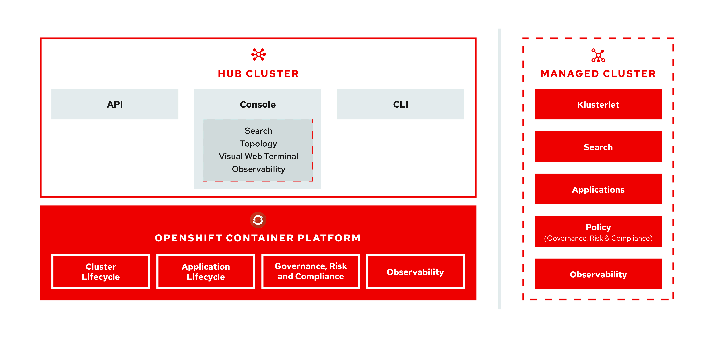

[#multicluster-architecture]
= Multicluster architecture

{product-title} consists of several multicluster components, which are used to access and manage your clusters. Learn more about the architecture in the following sections, then follow the links to more detailed documentation.

Learn more about the following components for {product-title}:

* Hub cluster
* Managed cluster
* Cluster lifecycle
* Application lifecycle
* Governance and risk
* Observability

[#hub-cluster]
== Hub cluster

The _hub_ cluster is the common term that is used to define the central controller that runs in a {product-title} cluster. From the hub cluster, you can access the console and product components, as well as the {product-title-short} APIs.

From the hub cluster, you can use the console to search resources across clusters and view your topology. The Visual Web Terminal provides an interface that merges the speed of a CLI with the convenience of an interactive table with direct linking like a graphical user interface. This enables you to use the Visual Web Terminal to run many commands, like `oc` and `kubectl` commands, and run searches across your managed clusters. You can then explore the results from the Visual Web Terminal searches in a selectable table format. 

Additionally, you can enable _observability_ on your hub cluster to monitor metrics from your managed clusters across your cloud providers.

The hub cluster aggregates information from multiple clusters by using an asynchronous work request model and search collectors. With a graph database, the hub cluster maintains the state of clusters and applications that run on it. 

[#managed-cluster]
== Managed cluster

The _managed_ cluster is the term that is used to define additional clusters that are managed by the hub cluster. The connection between the two is completed by using the _Klusterlet_, which is the agent that is installed on the managed cluster. The managed cluster receives and applies requests from the hub cluster and enables it to service cluster lifecycle, application lifecycle, governanace and risk, and observability on the managed cluster. 

For example, managed clusters send metrics to the hub cluster if the observability service is enabled. See link:../observability/observe_intro.adoc#observing-environments-intro[Observing environments] to receive metrics and optimize the health of all managed clusters.

[#cluster-lifecycle]
== Cluster lifecycle

{product-title-short} _cluster lifecycle_ defines the process of creating, importing, and managing Kubernetes clusters across various public cloud providers, private clouds, and on-premises datacenters.

From the hub cluster console, you can view an aggregation of all cluster health statuses, or view individual health metrics of many Kubernetes clusters. Additionally, you can upgrade managed {ocp-short} clusters individually or in bulk, as well as destroy any {ocp-short} clusters that you created using your hub cluster.

See link:../manage_cluster/intro.adoc[Managing your clusters] to learn about managing clusters, which is part of _Cluster lifecycle_.

[#application-lifecycle]
== Application lifecycle

{product-title-short} _Application lifecycle_ defines the processes that are used to manage application resources on your managed clusters. A multicluster application allows you to deploy resources on multiple managed clusters, as well as maintain full control of Kubernetes resource updates for all aspects of the application with high availability.

A multicluster application uses the Kubernetes specification, but provides additional automation of the deployment and lifecycle management of resources. As a technology preview function, the integration of Ansible Tower jobs enables scheduling automated tasks.  

See link:../manage_applications/app_management_overview.adoc[Managing applications] for more application topics.

[#governance-and-risk]
== Governance and risk

_Governance and risk_ enables you to define policies that either enforce security compliance, or alert you of changes that violate the configured compliance requirements for your environment. You can manage the policies and compliance requirements across all of your management clusters from a central interface page.
After you configure a {product-title-short} hub cluster and a managed cluster, you can view and create policies with the {product-title-short} policy framework. You can take advantage of the link:https://github.com/open-cluster-management/policy-collection/tree/master/community[`policy-collection` community] to see what policies community members created and contributed, as well as contribute your own policies for others to use. 

For more information about Governance and risk, see the link:../security/security_intro.adoc[Security] introduction. Additionally, learn about access requirements from the link:../security/rbac.adoc#role-based-access-control[Role-based access control] documentation.

[#observability-arch]
== Observability

The _Observability_ component collects and reports the status and health of the {ocp-short} version 4.x, or later, managed clusters to the hub cluster. You can create custom alerts to inform you of problems with your fleet of managed clusters. Because it requires configured persistent storage, observability must be enabled after the {product-title-short} installation.  

For more information about Observability, see link:../observability/observe_intro.adoc[Observing environments].

See the product link:../install/install_overview.adoc#installing[Installing] section to prepare your cluster and get configuration information.

See the xref:../about/components.adoc#components[Components and services] topic to learn more about what is installed with the product.
