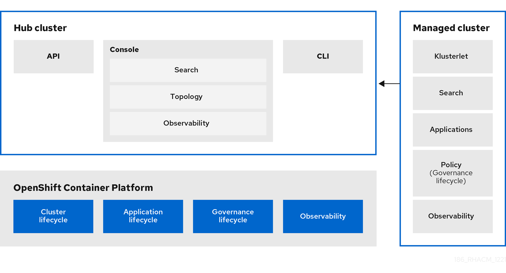

:_mod-docs-content-type: CONCEPT

[#multicluster-architecture]
= Multicluster architecture

[role="_abstract"]
{acm} consists of several multicluster components, which are used to access and manage your clusters.

* Hub cluster

+
The _hub_ cluster is the common term that is used to define the central controller that runs in a {acm} cluster. From the hub cluster, you can access the console and product components, as well as the {acm-short} APIs. You can also use the console to search resources across clusters and view your topology.

Additionally, you can enable _observability_ on your hub cluster to monitor metrics from your managed clusters across your cloud providers.

The {acm-short} hub cluster uses the `MultiClusterHub` operator to manage, upgrade, and install hub cluster components and runs in the `open-cluster-management` namespace. The hub cluster aggregates information from multiple clusters by using an asynchronous work request model and search collectors. The hub cluster maintains the state of clusters and applications that run on it.

The _local cluster_ is the term used to define a hub cluster that is also a managed cluster.

* Managed cluster

+
The _managed_ cluster is the term that is used to define additional clusters that are managed by the hub cluster. The connection between the two is completed by using the _klusterlet_, which is the agent that is installed on the managed cluster. The managed cluster receives and applies requests from the hub cluster and enables it to service cluster lifecycle, application lifecycle, governance, and observability on the managed cluster.

For example, managed clusters send metrics to the hub cluster if the observability service is enabled.

* Cluster lifecycle

+
{acm-short} _cluster lifecycle_ defines the process of creating, importing, managing, and destroying Kubernetes clusters across various infrastructure cloud providers, private clouds, and on-premises data centers.

The cluster lifecycle function is provided by the {mce}, which is installed automatically with {acm-short}.

From the hub cluster console, you can view an aggregation of all cluster health statuses, or view individual health metrics of many Kubernetes clusters. Additionally, you can update managed {ocp-short} clusters individually or in bulk, as well as destroy any {ocp-short} clusters that you created using your hub cluster. From the console, you can also hibernate, resume, and detach clusters.

* Application lifecycle

+
{acm-short} _Application lifecycle_ defines the processes that are used to manage application resources on your managed clusters. A multicluster application allows you to deploy resources on multiple managed clusters, as well as maintain full control of Kubernetes resource updates for all aspects of the application with high availability.

A multicluster application uses the Kubernetes specification, but provides additional automation of the deployment and lifecycle management of resources. {aap-short} jobs allow you to automate tasks. You can also set up a continuous GitOps environment to automate application consistency across clusters in development, staging, and production environments.

* Governance

+
_Governance_ enables you to define policies that either enforce security compliance, or inform you of changes that violate the configured compliance requirements for your environment. Using dynamic policy templates, you can manage the policies and compliance requirements across all of your management clusters from a central interface.

After you configure a {acm-short} hub cluster and a managed cluster, you can view and create policies with the {acm-short} policy framework.

* Observability

+
The _observability_ component collects and reports the status and health of the {ocp-short} version 4.x or later, managed clusters to the hub cluster, which are visible from the Grafana dashboard. You can create custom alerts to inform you of problems with your managed clusters. Since observability requires configured persistent storage, enable observability after the {acm-short} installation is complete.

.Additional resources

* link:../observability/observe_environments.adoc#observing-environments[Observing environments]
* link:../clusters/cluster_lifecycle/cluster_lifecycle_intro.adoc#cluster-intro[Cluster lifecycle introduction]
* link:../applications/app_management_overview.adoc#managing-applications[Managing applications]
* link:../secure_clusters/rbac.adoc#rbac-rhacm[Role-based access control]
* link:https://github.com/stolostron/policy-collection/tree/main/community[`policy-collection` open community]
* link:../observability/observe_environments_intro.adoc#observing-environments-intro[Observing environments introduction]
* link:../release_notes/release_notes.adoc#red-hat-advanced-cluster-management-for-kubernetes-release-notes[Release notes]
* link:../install/install_overview.adoc#installing[Installing and upgrading]
* link:../clusters/about/cluster_mce_overview.adoc#cluster_mce_overview[Cluster lifecycle overview]
