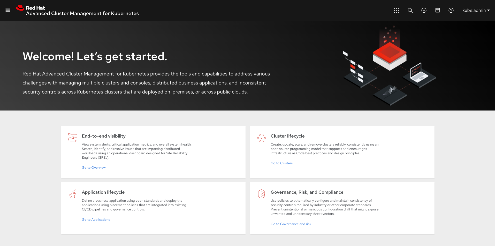

[#welcome-to-red-hat-advanced-cluster-management-for-kubernetes]
= Welcome to Red Hat Advanced Cluster Management for Kubernetes

Kubernetes provides a platform for deploying and managing containers in a standard, consistent control plane.
However, as application workloads move from development to production, they often require multiple fit-for-purpose Kubernetes clusters to support DevOps pipelines.

*Note:* Use of this Red Hat product requires licensing and subscription agreement. 

Users, such as administrators and site reliability engineers, face challenges as they work across a range of environments, including multiple data centers, private clouds, and public clouds that run Kubernetes clusters.
Red Hat Advanced Cluster Management for Kubernetes provides the tools and capabilities to address these common challenges.

Red Hat Advanced Cluster Management for Kubernetes provides end-to-end management visibility and control to manage your Kubernetes environment.
Take control of your application modernization program with management capabilities for cluster creation, application lifecycle, and provide security and compliance for all of them across data centers and hybrid cloud environments.
Clusters and applications are all visible and managed from a single console, with built-in security policies.
Run your operations from anywhere that Red Hat OpenShift runs, and manage any Kubernetes cluster in your fleet.

See the following image of the _Welcome page_ from the Red Hat Advanced Cluster Management for Kubernetes console. The header displays the _Applications_ icon to return to OpenShift Container Platform, access to the Visual Web Terminal, and more. The tiles describe the main fuctions of the product and link to important console pages.

With Red Hat Advanced Cluster Management for Kubernetes:

* Work across a range of environments, including multiple data centers, private clouds and public clouds that run Kubernetes clusters.
* Easily create Kubernetes clusters and offer cluster lifecycle management in a single console.
* Enforce policies at the target clusters using Kubernetes-supported custom resource definitions.
* Deploy and maintain day-two operations of business applications distributed across your cluster landscape.

This guide assumes that users are familiar with Kubernetes concepts and terminology.
For more information about Kubernetes concepts, see https://kubernetes.io/docs/home/[Kubernetes Documentation].

See the following documentation for information about the product:

* xref:../about/architecture.adoc#multicluster-architecture[Multicluster architecture]
* xref:../about/components.adoc#components[Components]
* link:../install#installing[Installing]
