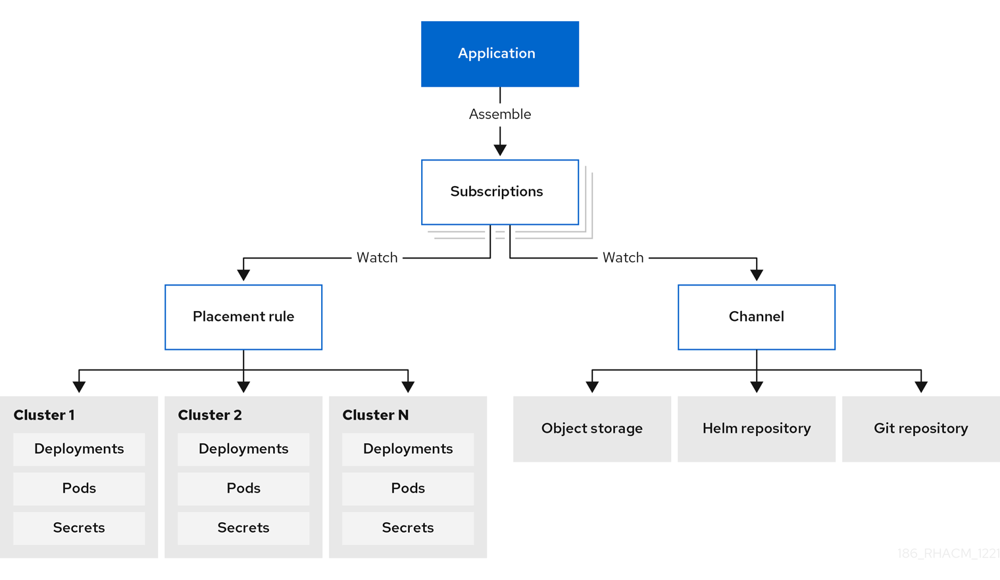

[#application-model-and-definitions]
= Application model and definitions

The application model is based on subscribing to one or more Kubernetes resource repositories (_channel_ resources) that contains resources that are deployed on managed clusters. Both single and multicluster applications use the same Kubernetes specifications, but multicluster applications involve more automation of the deployment and application management lifecycle.

See the following image to understand more about the application model:

image:../images/basic-application-model2.1.png[Application model]

View the following application resource sections:

* <<applications,Applications>>
* <<subscriptions,Subscriptions>>
* <<applicationset,ApplicationSet>>
* <<applicationdoc,Application documentation>>

[#applications]
== Applications

Applications (`application.app.k8s.io`) in {product-title} are used for grouping Kubernetes resources that make up an application.

All of the application component resources for {product-title} applications are defined in YAML file specification sections. When you need to create or update an application component resource, you need to create or edit the appropriate section to include the labels for defining your resource. 

You can also work with _Discovered_ applications, which are applications that are discovered by the {ocp-short} GitOps or an Argo CD operator that is installed in your clusters. Applications that share the same repository are grouped together in this view.

[#subscriptions]
== Subscriptions

Subscriptions (`subscription.apps.open-cluster-management.io`) allow clusters to subscribe to a source repository (channel) that can be the following types: Git repository, Helm release registry, or Object storage repository. 

*Note:* Self-managing the hub cluster is not recommended because the resources might impact the hub cluster. 
// is this still true?

Subscriptions can deploy application resources locally to the hub cluster if the hub cluster is self-managed. You can then view the `local-cluster` (the self-managed hub cluster) subscription in the topology. Resource requirements might adversely impact hub cluster performance.

Subscriptions can point to a channel or storage location for identifying new or updated resource templates. The subscription operator can then download directly from the storage location and deploy to targeted managed clusters without checking the hub cluster first. With a subscription, the subscription operator can monitor the channel for new or updated resources instead of the hub cluster.

See the following subscription architecture image: 

[#channels]
=== Channels

Channels (`channel.apps.open-cluster-management.io`) define the source repositories that a cluster can subscribe to with a subscription, and can be the following types: Git, Helm release, and Object storage repositories, and resource templates on the hub cluster.

If you have applications that require Kubernetes resources or Helm charts from channels that require authorization, such as entitled Git repositories, you can use secrets to provide access to these channels. Your subscriptions can access Kubernetes resources and Helm charts for deployment from these channels, while maintaining data security.

Channels use a namespace within the hub cluster and point to a physical place where resources are stored for deployment. Clusters can subscribe to channels for identifying the resources to deploy to each cluster.

**Notes:** It is best practice to create each channel in a unique namespace. However, a Git channel can share a namespace with another type of channel, including Git, Helm, and Object storage.

Resources within a channel can be accessed by only the clusters that subscribe to that channel.

[#supported-git-servers]
==== Supported Git repository servers

* GitHub
* GitLab
* Bitbucket
* Gogs 

[#placement-rules]
=== Placement rules

Placement rules (`placementrule.apps.open-cluster-management.io`) define the target clusters where resource templates can be deployed. Use placement rules to help you facilitate the multicluster deployment of your deployables. Placement rules are also used for governance and risk policies. For more information on how, see link:../governance/grc_intro.adoc#governance[Governance].

[#applicationset]
== ApplicationSet

`ApplicationSet` is a sub-project of Argo CD that is supported by the GitOps Operator. `ApplicationSet` adds multicluster support for Argo CD applications. You can create an `ApplicationSet` from the {product-title-short} console. 

{ocp-short} GitOps uses Argo CD to maintain cluster resources. Argo CD is an open-source declarative tool for the continuous integration and continuous deployment (CI/CD) of applications. {ocp-short} GitOps implements Argo CD as a controller ({ocp-short} GitOps Operator) so that it continuously monitors application definitions and configurations defined in a Git repository. Then, Argo CD compares the specified state of these configurations with their live state on the cluster.

The `ApplicationSet` controller is installed on the cluster through a GitOps operator instance and supplements it by adding additional features in support of cluster-administrator-focused scenarios. The `ApplicationSet` controller provides the following function:

* The ability to use a single Kubernetes manifest to target multiple Kubernetes clusters with the GitOps operator.

* The ability to use a single Kubernetes manifest to deploy multiple applications from one or multiple Git repositories with the GitOps operator.

* Improved support for monorepo, which is in the context of Argo CD, multiple Argo CD Application resources that are defined within a single Git repository.

* Within multitenant clusters, improved ability of individual cluster tenants to deploy applications using Argo CD without needing to involve privileged cluster administrators in enabling the destination clusters/namespaces.

The `ApplicationSet` operator leverages the cluster decision generator to interface Kubernetes custom resources that use custom resource-specific logic to decide which managed clusters to deploy to. A cluster decision resource generates a list of managed clusters, which are then rendered into the template fields of the `ApplicationSet` resource. This is done using duck-typing, which does not require knowledge of the full shape of the referenced Kubernetes resource. 

See the following example of a `generators.clusterDecisionResource` value within an `ApplicationSet`:

[source,yaml]
----
apiVersion: argoproj.io/v1alpha1
kind: ApplicationSet
metadata:
  name: sample-application-set
  namespace: sample-gitops-namespace
spec:
  generators:
    - clusterDecisionResource:
        configMapRef: acm-placement
        labelSelector:
          matchLabels:
            cluster.open-cluster-management.io/placement: sample-application-placement
        requeueAfterSeconds: 180
  template:
    metadata:
      name: sample-application-{{name}}
    spec:
      project: default
      source:
        repoURL: https://github.com/sampleapp/apprepo.git
        targetRevision: main
        path: sample-application
      destination:
        namespace: sample-application
        server: "{{server}}"
      syncPolicy:
        syncOptions:
          - CreateNamespace=true
          - PruneLast=true
          - Replace=true
          - ApplyOutOfSyncOnly=true
          - Validate=false
        automated:
          prune: true
          allowEmpty: true
          selfHeal: true
----

See the following `Placement`:

[source,yaml]
----
apiVersion: cluster.open-cluster-management.io/v1beta1
kind: Placement
metadata:
  name: sample-application-placement
  namespace: sample-gitops-namespace
spec:
  clusterSets:
    - sampleclusterset
----

If you would like to learn more about `ApplicationSets`, see link:https://argocd-applicationset.readthedocs.io/en/stable/Generators-Cluster-Decision-Resource/[Cluster Decision Resource Generator].

[#applicationdoc]
== Application documentation

Learn more from the following documentation:

* xref:../applications/app_console.adoc#application-console[Application console]
* xref:../applications/app_resources.adoc#managing-application-resources[Managing application resources] 
* xref:../applications/manage_apps_git.adoc#managing-apps-with-git-repositories[Managing apps with Git repositories]
* xref:../applications/manage_apps_helm.adoc#managing-apps-with-helm-cluster-repositories[Managing apps with Helm repositories]
* xref:../applications/manage_apps_object.adoc#managing-apps-with-object-storage-repositories[Managing apps with Object storage repositories]
* xref:../applications/app_advanced_config.adoc#application-advanced-configuration[Application advanced configuration]
* xref:../applications/subscribe_git_resources.adoc#subscribing-git-resources[Subscribing Git resources] 
* xref:../applications/ansible_config.adoc#setting-up-ansible[Setting up Ansible Tower tasks] 
* xref:../applications/channel_sample.adoc#channel-samples[Channel samples]
* xref:../applications/subscription_sample.adoc#subscription-samples[Subscription samples]
* xref:../applications/placement_sample.adoc#placement-rule-samples[Placement rule samples]
* xref:../applications/app_sample.adoc#application-samples[Application samples]
