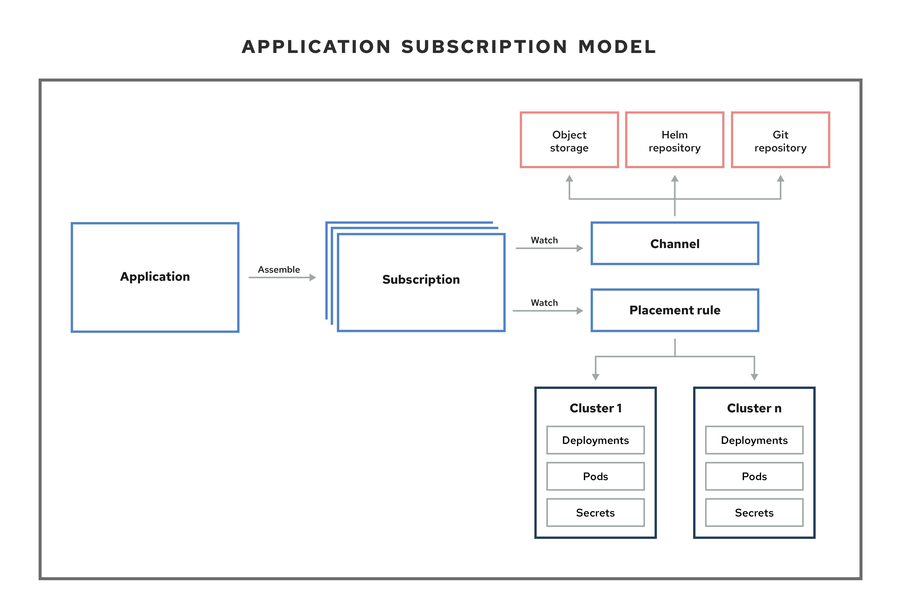

:_mod-docs-content-type: CONCEPT

[#application-model-and-definitions]
= Application model and definitions (Deprecated)

[role="_abstract"]
The application model is based on subscribing to one or more Kubernetes resource repositories (_channel_ resources) that contains resources that are deployed on managed clusters. Both single and multicluster applications use the same Kubernetes specifications, but multicluster applications involve more automation of the deployment and application management lifecycle.

*Deprecation:* Application _subscription_, and all processes that use Application subscription, is deprecated. See link:../gitops/gitops_overview.adoc#gitops-overview[GitOps overview] for updated function.

See the following image to understand more about the application model:

View the following application resource sections:

* xref:../applications/app_model_apps.adoc#applications[Applications]
* xref:../applications/app_model_subs.adoc#subscriptions[Subscriptions]
* xref:../applications/app_model_appset.adoc#applicationset[ApplicationSet]
* xref:../applications/app_model_docs.adoc#applicationdoc[Application documentation]

*Best practice:* Use the GitOps Operator or Argo CD integration instead of the _Channel_ and _Subscription_ model. Learn more from the link:../gitops/gitops_overview.adoc#gitops-overview[GitOps overview].
