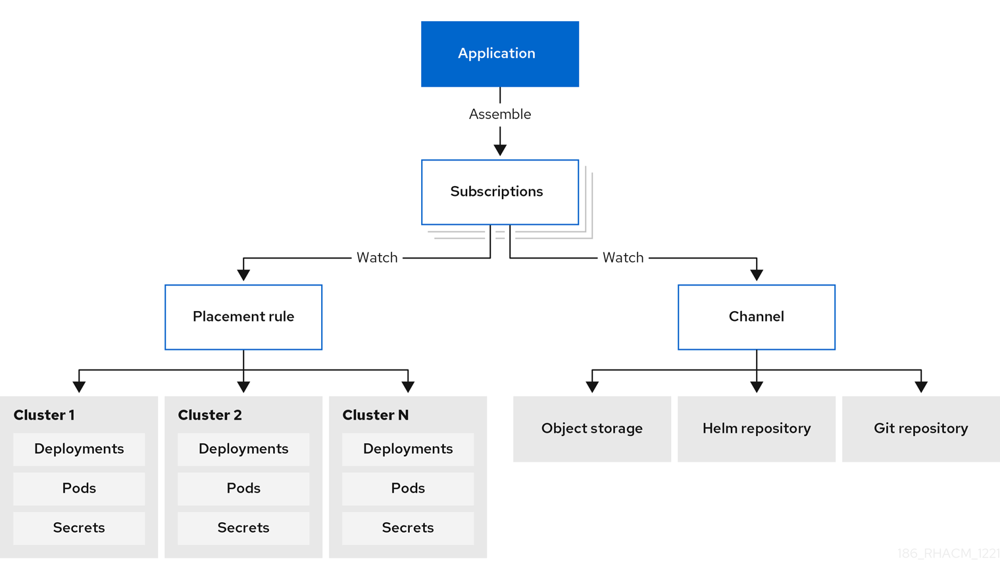

:_mod-docs-content-type: CONCEPT

[#subscriptions]
= Subscriptions

[role="_abstract"]
Subscriptions (`subscription.apps.open-cluster-management.io`) allow clusters to subscribe to a source repository (channel) that can be the following types: Git repository, Helm release registry, or Object storage repository.  

Subscriptions can deploy application resources locally to the hub cluster if the hub cluster is self-managed. You can then view the `local-cluster` (the self-managed hub cluster) subscription in the topology. Resource requirements might adversely impact hub cluster performance.

Subscriptions can point to a channel or storage location for identifying new or updated resource templates. The subscription operator can then download directly from the storage location and deploy to targeted managed clusters without checking the hub cluster first. With a subscription, the subscription operator can monitor the channel for new or updated resources instead of the hub cluster.

See the following subscription architecture image:

* xref:../applications/app_model_channels.adoc#channels[Channels]
