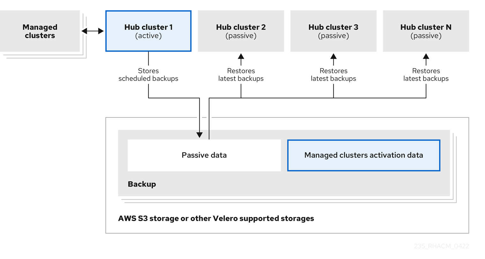

[#backup-intro]
= Backup and restore

The cluster backup and restore operator provides disaster recovery solutions for {product-title} hub cluster failure. The cluster backup and restore operator runs on the hub cluster and depends on the link:https://github.com/openshift/oadp-operator[OADP Operator] to install Velero, and to create a connection from the hub cluster to the backup storage location where the data is stored.

Learn how to configure an active-passive hub cluster configuration, where the initial hub cluster backs up data and one, or more passive hub clusters are on stand-by to control the managed clusters when the active cluster becomes unavailable. 

Also learn more on how the backup and restore component sends alerts using a policy that is configured to let the administrator know when the main hub cluster is unavailable, and a restore operation might be required. The same policy alerts the administrator if the backup solution is not functioning as expected, even if the main hub cluster is active and managing the clusters. It reports any issues with the backup data not being produced, or any other issues that can result in backup data and an unavailable hub cluster.

Velero is the component that runs the backup and restore operations. The cluster backup and restore operator solution provides backup and restore support for all {product-title-short} hub cluster resources, including managed clusters, applications, policies, and bare metal assets.

The cluster backup and restore operator supports backups of any third-party resources that extend the hub cluster installation. With this backup solution, you can define cron-based backup schedules which run at specified time intervals. When the hub cluster goes down, a new hub cluster can be deployed and the backed up data is moved to the new hub cluster.

Continue reading the following topics to learn more about the backup and restore operator:

* <<active-passive-config,Active passive configuration>>
* <<disaster-recovery,Disaster recovery>>
* <<backup-restore-architecture,Backup and restore operator architecture>>
** <<resources-that-are-backed-up,Resources that are backed up>>
** <<resources-restored-managed-cluster-activation,Resources restored at managed clusters activation time>>
** <<resource-requests-and-limits,Resource requests and limits customization>>
* <<managed-cluster-activation-data,Managed cluster activation data>>

[#active-passive-config]
== Active passive configuration

In an active passive configuration, there is one active hub cluster and passive hub clusters. An active hub cluster is also considered the primary hub cluster, which manages clusters and backs up resources at defined time intervals, using the `BackupSchedule.cluster.open-cluster-management.io` resource. 

Passive hub clusters continuously retrieve the latest backups and restore the passive data. The passive hubs use the `Restore.cluster.open-cluster-management.io` resource to restore passive data from the primary hub cluster when new backup data is available. These hub clusters are on standby to become a primary hub when the primary hub cluster goes down.

Active and passive hub clusters are connected to the same storage location, where the primary hub cluster backs up data for passive hub clusters to access the primary hub cluster backups. For more details on how to setup this automatic restore configuration, see the <<restore-passive-resources-check-backups,Restoring passive resources while checking for backups>> section.

In the following diagram, the active hub cluster manages the local clusters and backs up the hub cluster data at regular intervals:

 

The passive hub cluster restores this data, except for the managed cluster activation data, which moves the managed clusters to the passive hub cluster. The passive hub clusters can restore the passive data continuously, see the xref:../manage_backup_restore.adoc#restore-passive-resources-check-backups[Restoring passive resources while checking for backups] section. Passive hub clusters can restore passive data as a one-time operation, see xref:../manage_backup_restore.adoc#restore-passive-resources[Restoring passive resources] section for more details. 

[#disaster-recovery]
== Disaster recovery

When the primary hub cluster goes down, one of the passive hub clusters is chosen by the administrator to take over the managed clusters. In the following image, the administrator decides to use _Hub cluster N_ as the new primary hub cluster:

image:../images/disaster_recovery.png[Disaster recovery diagram] 

_Hub cluster N_ restores the managed cluster activation data. At this point, the managed clusters connect with _Hub cluster N_. The administrator activates a backup on the new primary hub cluster, _Hub cluster N_, by creating a `BackupSchedule.cluster.open-cluster-management.io` resource, and storing the backups at the same storage location as the initial primary hub cluster.

All other passive hub clusters now restore passive data using the backup data created by the new primary hub cluster. _Hub N_ is now the primary hub cluster, managing clusters and backing up data.

[#backup-restore-architecture]
== Backup and restore operator architecture

The operator defines the `backupSchedule.cluster.open-cluster-management.io` resource, which is used to set up {product-title-short} backup schedules, and `restore.cluster.open-cluster-management.io` resource, which is used to process and restore these backups. The operator creates corresponding Velero resources, and defines the options needed to backup remote clusters and any other hub cluster resources that need to be restored. View the following diagram:

image:../images/cluster_backup_controller_dataflow25.png[Backup and restore architecture diagram] 

[#resources-that-are-backed-up]
=== Resources that are backed up

The cluster backup and restore operator solution provides backup and restore support for all hub cluster resources like managed clusters, applications, policies, and bare metal assets. You can use the solution to back up any third-party resources extending the basic hub cluster installation. With this backup solution, you can define a cron-based backup schedule, which runs at specified time intervals and continuously backs up the latest version of the hub cluster content. 

When the hub cluster needs to be replaced or is in a disaster scenario when the hub cluster goes down, a new hub cluster can be deployed and backed up data is moved to the new hub cluster.

View the following ordered list of the cluster backup and restore process for identifying backup data:

* Exclude all resources in the `MultiClusterHub` namespace. This is to avoid backing up installation resources that are linked to the current hub cluster identity and should not be backed up.

* Backup all CRDs with an API version suffixed by `.open-cluster-management.io`. This suffix indicates that all {product-title-short} resources are backed up.

* Backup all CRDs from the following API groups: `argoproj.io`, `app.k8s.io`, `core.observatorium.io`, `hive.openshift.io`.

* Exclude all CRDs from the following API groups: `admission.cluster.open-cluster-management.io`, `admission.work.open-cluster-management.io`,  `internal.open-cluster-management.io`, `operator.open-cluster-management.io`, `work.open-cluster-management.io`, `search.open-cluster-management.io`, `admission.hive.openshift.io`, `velero.io`.

* Exclude the following CRDs that are a part of the included API groups, but are either not needed or are being recreated by owner-resources, which are also backed up: `clustermanagementaddon`, `observabilityaddon`, `applicationmanager`, `certpolicycontroller`, `iampolicycontroller`, `policycontroller`, `searchcollector`, `workmanager`, `backupschedule`, `restore`, `clusterclaim.cluster.open-cluster-management.io`.

* Backup secrets and ConfigMaps with one of the following labels: `cluster.open-cluster-management.io/type`, `hive.openshift.io/secret-type`, `cluster.open-cluster-management.io/backup`. 

* Use the following label for any other resources that you want to be backed up and are not included in the previously mentioned criteria, `cluster.open-cluster-management.io/backup`. See the following example:
+
[source,yaml]
----
apiVersion: my.group/v1alpha1
kind: MyResource
 metadata:
   labels:
    cluster.open-cluster-management.io/backup: ""
----
+
*Note:* Secrets used by the `hive.openshift.io.ClusterDeployment` resource need to be backed up, and are automatically annotated with the `cluster.open-cluster-management.io/backup` label only when the cluster is created using the console. If the Hive cluster is deployed using GitOps instead, the `cluster.open-cluster-management.io/backup` label must be manually added to the secrets used by the `ClusterDeployment`.

* Exclude specific resources that you do not want backed up. For example, see the following example to exclude Velero resources from the backup process:
+
[source,yaml]
----
apiVersion: my.group/v1alpha1
kind: MyResource
 metadata:
  labels:
    velero.io/exclude-from-backup: "true"
----

[#resources-restored-managed-cluster-activation]
==== Resources restored at managed clusters activation time

When you add the `cluster.open-cluster-management.io/backup` label to a resource, the resource is automatically backed up in the `acm-resources-generic-schedule` backup. You must set the label value to `cluster-activation` if any of the resources need to be restored, only after the managed clusters are moved to the new hub cluster and when the `veleroManagedClustersBackupName:latest` is used on the restored resource. This ensures the resource is not restored unless the managed cluster activation is called. View the following example:

[source,yaml]
----
apiVersion: my.group/v1alpha1
kind: MyResource
 metadata:
  labels:
    cluster.open-cluster-management.io/backup: cluster-activation
----

Aside from the activation data resources that are identified by using the `cluster.open-cluster-management.io/backup: cluster-activation` label and stored by the `acm-resources-generic-schedule` backup, the cluster backup and restore operator includes a few resources in the activation set, by default. The following resources are backed up by the `acm-managed-clusters-schedule` backup:

* `managedcluster.cluster.open-cluster-management.io`
* `managedcluster.clusterview.open-cluster-management.io`
* `klusterletaddonconfig.agent.open-cluster-management.io`
* `managedclusteraddon.addon.open-cluster-management.io`
* `managedclusterset.cluster.open-cluster-management.io`
* `managedclusterset.clusterview.open-cluster-management.io`
* `managedclustersetbinding.cluster.open-cluster-management.io`
* `clusterpool.hive.openshift.io`
* `clusterclaim.hive.openshift.io`
* `clustercurator.cluster.open-cluster-management.io`

[#resource-requests-and-limits]
=== Resource requests and limits customization

When Velero is initially installed, Velero pod is set to the default CPU and memory limits as defined in the following sample:

[source,yaml]
----
resources:
 limits:
   cpu: "1"
   memory: 256Mi
 requests:
   cpu: 500m
   memory: 128Mi
----

The limits from the previous sample work well with some scenarios, but might need to be updated when your cluster backs up a large number of resources. For instance, when back up is run on a hub cluster that manages 2000 clusters, then the Velero pod crashes due to the out-of-memory error (OOM). The following configuration allows for the backup to complete for this scenario:

[source,yaml]
----
  limits:
    cpu: "2"
    memory: 1Gi
  requests:
    cpu: 500m
    memory: 256Mi
----

To update the limits and requests for the Velero pod resource, you need to update the `DataProtectionApplication` resource and insert the `resourceAllocation` template for the Velero pod. View the following sample:

[source,yaml]
----
apiVersion: oadp.openshift.io/v1alpha1
kind: DataProtectionApplication
metadata:
  name: velero
  namespace: open-cluster-management-backup
spec:
...
  configuration:
...
    velero:
      podConfig:
        resourceAllocations:
          limits:
            cpu: "2"
            memory: 1Gi
          requests:
            cpu: 500m
            memory: 256Mi
----

Refer to the link:https://github.com/openshift/oadp-operator/blob/master/docs/config/resource_req_limits.md[Velero resource requests and limits customization] to find out more about the `DataProtectionApplication` parameters.

[#managed-cluster-activation-data]
== Managed cluster activation data

Managed cluster activation data or other activation data, is a backup resource. When the activation data is restored on a new hub cluster, managed clusters are then being actively managed by the hub cluster where the restore is run. Activation data resources are stored by the managed clusters backup and by the resource-generic backup, when you use the `cluster.open-cluster-management.io/backup: cluster-activation` label. 

See xref:../backup_restore/manage_backup_restore.adoc#manage-backup-and-restore[Managing the backup and restore operator] to learn how you can use the operator.

