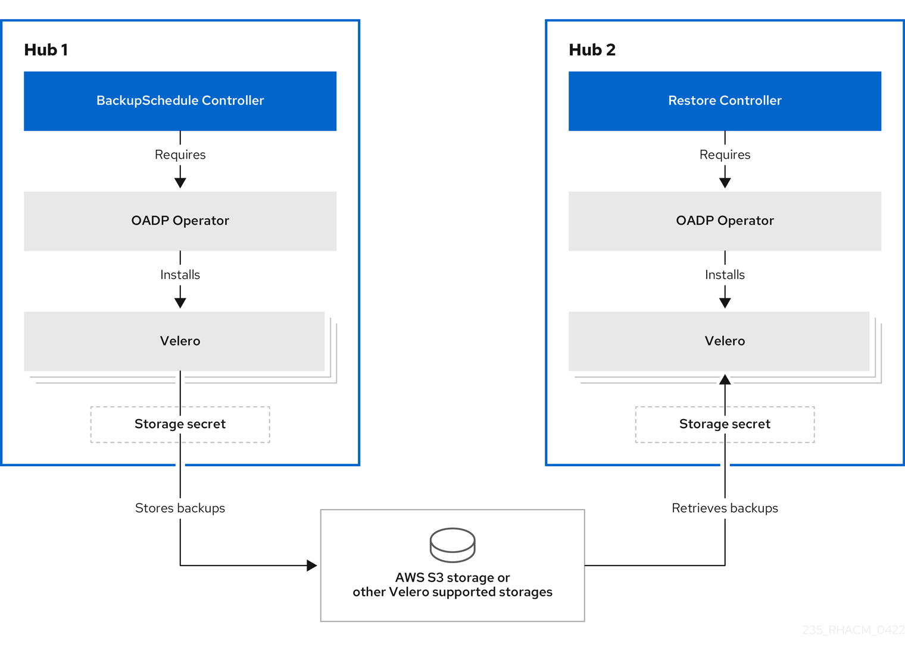
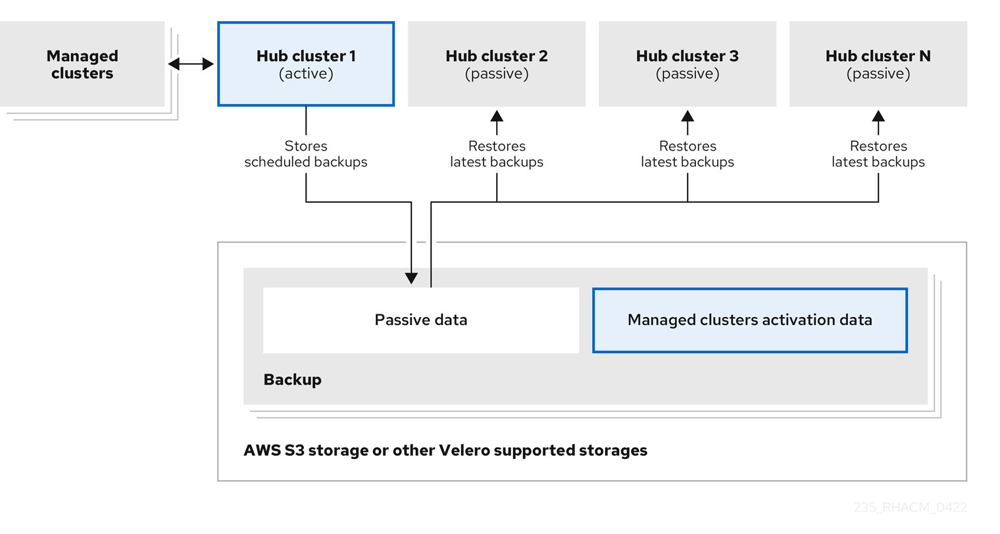
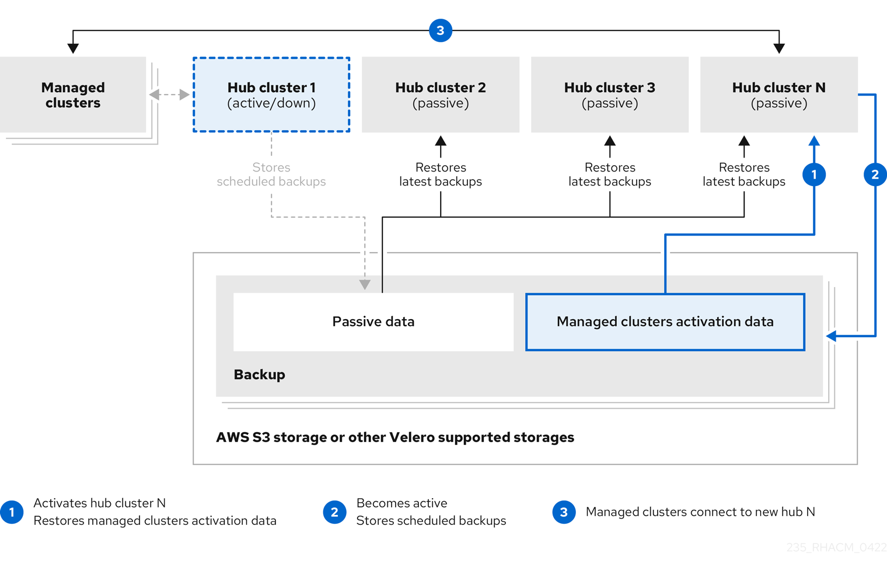

[#hub-backup-and-restore]
= Cluster backup and restore operator

The cluster backup and restore operator provides disaster recovery solutions for when {product-title} hub cluster goes down and needs to be recreated. It runs on the hub cluster and depends on the link:https://github.com/openshift/oadp-operator[OADP Operator] to install Velero, and to create a connection from the hub cluster to the backup storage location where the data is stored. Velero is the component that runs the backup and restore operations. The cluster backup and restore operator solution provides backup and restore support for all {product-title-short} hub cluster resources, like managed clusters, applications, policies, and bare metal assets.

It supports backups of any third-party resources that extend the hub cluster installation. With this backup solution, you can define cron-based backup schedules which run at specified time intervals. When the hub cluster goes down, a new hub cluster can be deployed and the backed up data is moved to the new hub cluster. 

The cluster backup and restore operator is not installed automatically. Enable the backup component by setting the `cluster-backup` parameter to `true`, in the `MultiClusterHub` resource. The OADP Operator is automatically installed, in the same namespace as the backup resource, when you install the cluster backup and restore operator.

*Notes*: 

* The OADP Operator 1.0 has disabled building multi-arch builds and only produces `x86_64` builds for the official release. This means that if you are using an architecture other than `x86_64`, the OADP Operator installed by the backup component must be replaced with the correct version. In this case, uninstall the OADP Operator and find the operator matching your architecture, then install it.

* If you have previously installed and used the OADP Operator on the hub cluster, uninstall this version since the backup component works now with OADP installed in the component namespace. Use the same storage location for the link:https://github.com/openshift/oadp-operator/blob/master/docs/install_olm.md#create-the-dataprotectionapplication-custom-resource[`DataProtectionApplication`] resource owned by the OADP Operator installed with the backup component; it accesses the same backup data as the previous operator. Velero backup resources are now loaded within the new OADP Operator namespace on this hub cluster.

link:https://velero.io/[Velero] is installed with the OADP Operator on the {product-title-short} hub cluster; Velero is used to backup and restore {product-title-short} hub cluster resources. 

For a list of supported storage providers for Velero, see https://velero.io/docs/v1.7/supported-providers/#s3-compatible-object-store-providers[S3-Compatible object store providers].

* <<prerequisites-backup-restore,Prerequisites>>
* <<backup-restore-architecture,Backup and restore operator architecture>>
** <<resource-requests-and-limits,Resource requests and limits customization>>
** <<protecting-data-using-server-side-encryption,Protecting data using server-side encryption>>
** <<schedule-backup,Schedule a cluster backup>>
* <<restore-backup,Restore a backup>>
** <<prepare-new-hub,Prepare the new hub cluster>>
** <<clean-hub-restore,Clean the hub cluster before restore>>
** <<resources-restored-managed-cluster,Resources restored at managed activation time>>
** <<restore-passive-resources,Restore passive resources>>
** <<restore-passive-resources-check-backups,Restore passive resources while checking for backups>>
** <<restore-activation-resources,Restore activation resources>>
*** <<primary-cluster-shut-down,Primary cluster must be shut down>>
* <<active-passive-config,Active passive configuration>>
** <<managed-cluster-activation-data,Managed cluster activation data>>
* <<disaster-recovery,Disaster recovery>>
* <<backup-validation-using-a-policy,Backup validation using a policy>>

[#prerequisites-backup-restore]
== Prerequisites

- Be sure to complete the steps to link:https://github.com/openshift/oadp-operator/blob/master/docs/install_olm.md#create-credentials-secret[Create credentials secret] for the cloud storage where the backups are saved. 

- Use the created secret when you create a `DataProtectionApplication` resource.
+
Complete the following steps to create an instance of the `DataProtectionApplication` resource:
+
. From the {ocp} console, select *Operators* > *Installed Operators*.
. Click `Create instance` under DataProtectionApplication.
. Create the Velero instance by selecting configurations using the {ocp-short) console or by using a YAML file as mentioned in the `DataProtectionApplication` example.
. Set the specification (spec:) values appropriately for the `DataProtectionApplication` resource. Then click *Create*.
+
The resource values are mentioned for ease of use. If you intend on using the default backup storage location, set the following value, `default: true` in the `backupStorageLocations` section. Your `DataProtectionApplication` resource might resemble the following YAML file:
+
Your `DataProtectionApplication` resource might resemble the following YAML file:
+
[source,yaml]
----
apiVersion: oadp.openshift.io/v1alpha1
kind: DataProtectionApplication
metadata:
  name: dpa-sample
spec:
  configuration:
    velero:
      defaultPlugins:
      - openshift
      - aws
    restic:
      enable: true
  backupLocations:
    - name: default
      velero:
        provider: aws
        default: true
        objectStorage:
          bucket: my-bucket
          prefix: my-prefix
        config:
          region: us-east-1
          profile: "default"
        credential:
          name: cloud-credentials
          key: cloud
  snapshotLocations:
    - name: default
      velero:
        provider: aws
        config:
          region: us-west-2
          profile: "default"
----
+
**Note**: The cluster backup and restore operator resources must be created in the same namespace where the OADP Operator is installed.
+
See an example to create the link:https://github.com/openshift/oadp-operator/blob/master/docs/install_olm.md#create-the-dataprotectionapplication-custom-resource[`DataProtectionApplication` resource].

[#backup-restore-architecture]
== Backup and restore operator architecture

The operator defines the `backupSchedule.cluster.open-cluster-management.io` resource, which is used to set up {product-title-short} backup schedules, and `restore.cluster.open-cluster-management.io` resource, which is used to process and restore these backups. The operator creates corresponding Velero resources, and defines the options needed to backup remote clusters and any other hub cluster resources that need to be restored. View the following diagram:

 

[#resource-requests-and-limits]
=== Resource requests and limits customization

When Velero is initially installed, Velero pod is set to the default CPU and memory limits as defined in the following sample:

[source,yaml]
----
resources:
 limits:
   cpu: "1"
   memory: 256Mi
 requests:
   cpu: 500m
   memory: 128Mi
----

The limits from the previous sample work well with some scenarios, but might need to be updated when your cluster backs up a large number of resources. For instance, when back up is run on a hub cluster that manages 2000 clusters, then the Velero pod crashes due to the out-of-memory error (OOM). The following configuration allows for the backup to complete for this scenario:

[source,yaml]
----
  limits:
    cpu: "2"
    memory: 1Gi
  requests:
    cpu: 500m
    memory: 256Mi
----

To update the limits and requests for the Velero pod resource, you need to update the `DataProtectionApplication` resource and insert the `resourceAllocation` template for the Velero pod. View the following sample:

[source,yaml]
----
apiVersion: oadp.openshift.io/v1alpha1
kind: DataProtectionApplication
metadata:
  name: velero
  namespace: open-cluster-management-backup
spec:
...
  configuration:
...
    velero:
      podConfig:
        resourceAllocations:
          limits:
            cpu: "2"
            memory: 1Gi
          requests:
            cpu: 500m
            memory: 256Mi
----

Refer to the link:https://github.com/openshift/oadp-operator/blob/master/docs/config/resource_req_limits.md[Velero resource requests and limits customization] to find out more about the `DataProtectionApplication` parameters.

[#protecting-data-using-server-side-encryption]
=== Protecting data using server-side encryption

Server-side encryption is data encryption for the application or service that receives the data at the storage location. The backup mechanism itself does not encrypt data while in-transit (as it travels to and from backup storage location), or at rest (while it is stored on disks at backup storage location). Instead it relies on the native mechanisms in the object and snapshot systems.

You can use `serverSideEncryption` and `kmsKeyId` parameters to enable encryption for the backups stored in Amazon S3. For more details, see the link:https://github.com/vmware-tanzu/velero-plugin-for-aws/blob/main/backupstoragelocation.md[Backup Storage Location YAML]. The following sample specifies an AWS KMS key ID when setting up the `DataProtectionApplication` resource:

[source,yaml]
----
spec:
  backupLocations:
    - velero:
        config:
          kmsKeyId: 502b409c-4da1-419f-a16e-eif453b3i49f
          profile: default
          region: us-east-1
----

Refer to link:https://github.com/vmware-tanzu/velero/blob/main/site/content/docs/main/supported-providers.md[Velero supported storage providers] to find out about all of the configurable parameters of other storage providers.

[#schedule-backup]
=== Schedule a cluster backup

A backup schedule is activated when you create the `backupschedule.cluster.open-cluster-management.io` resource. View the following `backupschedule.cluster.open-cluster-management.io` sample:

[source,yaml]
----
apiVersion: cluster.open-cluster-management.io/v1beta1
kind: BackupSchedule
metadata:
  name: schedule-acm
spec:
  veleroSchedule: 0 */2 * * *
  veleroTtl: 120h
----

After you create a `backupschedule.cluster.open-cluster-management.io` resource, run the following command to get the status of the scheduled cluster backups:

----
oc get bsch -n <oadp-operator-ns>
----

The `<oadp-operator-ns>` parameter in the previous command is the namespace where the `BackupSchedule` is created, which is the same namespace where the OADP Operator is installed. The `backupschedule.cluster.open-cluster-management.io` resource creates six `schedule.velero.io` resources, which are used to generate backups. Run the following command to view the list of the backups that are scheduled:

----
os get schedules -A | grep acm
----

Resources are separately backed up in the following groups:

* _Credentials backup_, which contains three backup files for Hive, {product-title-short}, and user-created credentials.
* _Resources backup_, which contains one backup for the {product-title-short} resources and one for generic resources. These resources use the following label, `cluster.open-cluster-management.io/backup`.
* _Managed clusters backup_, which contains only resources that activate the managed cluster connection to the hub cluster, where the backup is restored.

*Note*: The _resources backup_ file contains managed cluster-specific resources, but does not contain the subset of resources that connect managed clusters to the hub cluster. The resources that connect managed clusters are called activation resources and are contained in the managed clusters backup. When you restore backups only for the _credentials_ and _resources_ backup on a new hub cluster, the new hub cluster shows all managed clusters created with the Hive API in a detached state. However, the managed clusters that are imported on the primary hub cluster using the import operation appear only when the activation data is restored on the passive hub cluster. At this time, the managed clusters are still connected to the original hub cluster that created the backup files.

When the activation data is restored, only managed clusters created using the Hive API are automatically connected with the new hub cluster. All other managed clusters appear in a _Pending_ state and must be manually reattached to the new cluster.

[#restore-backup]
== Restore a backup

In a usual restore scenario, the hub cluster where the backups are run becomes unavailable, and the backed up data needs to be moved to a new hub cluster. This is done by running the cluster restore operation on the new hub cluster. In this case, the restore operation runs on a different hub cluster than the one where the backup is created.

There are also cases where you want to restore the data on the same hub cluster where the backup was collected, so the data from a previous snapshot can be recovered. In this case, both restore and backup operations are run on the same hub cluster.

After you create a `restore.cluster.open-cluster-management.io` resource on the hub cluster, you can run the following command to get the status of the restore operation: `oc get restore -n <oadp-operator-ns>`. You should also be able to verify that the backed up resources that are contained by the backup file are created.

**Note**: The `restore.cluster.open-cluster-management.io` resource is run once. If you want to run the same restore operation again after the restore operation is complete, you have to create a new `restore.cluster.open-cluster-management.io` resource with the same `spec` options.

The restore operation is used to restore all three backup types that are created by the backup operation. However, you can choose to install only a certain type of backup (only managed clusters, only user credentials, or only hub cluster resources).

The restore defines the following three required `spec` properties, where the restore logic is defined for the types of backed up files:

* `veleroManagedClustersBackupName` is used to define the restore option for the managed clusters activation resources.
* `veleroCredentialsBackupName` is used to define the restore option for the user credentials.
* `veleroResourcesBackupName` is used to define the restore option for the hub cluster resources (`Applications`, `Policy`, and other hub cluster resources like managed cluster passive data).
+
The valid options for the previously mentioned properties are following values:
+
** `latest` - This property restores the last available backup file for this type of backup.
** `skip` - This property does not attempt to restore this type of backup with the current restore operation.
** `<backup_name>` - This property restores the specified backup pointing to it by name. 

The name of the `restore.velero.io` resources that are created by the `restore.cluster.open-cluster-management.io` is generated using the following template rule, `<restore.cluster.open-cluster-management.io name>-<velero-backup-resource-name>`. View the following descriptions:

* `restore.cluster.open-cluster-management.io name` is the name of the current `restore.cluster.open-cluster-management.io` resource, which initiates the restore.
* `velero-backup-resource-name` is the name of the Velero backup file that is used for restoring the data. For example, the `restore.cluster.open-cluster-management.io` resource named `restore-acm` creates `restore.velero.io` restore resources. View the following examples for the format:

** `restore-acm-acm-managed-clusters-schedule-20210902205438` is used for restoring managed cluster activation data backups. In this sample, the `backup.velero.io` backup name used to restore the resource is `acm-managed-clusters-schedule-20210902205438`.
** `restore-acm-acm-credentials-schedule-20210902206789` is used for restoring credential backups. In this sample, the `backup.velero.io` backup name used to restore the resource is `acm-managed-clusters-schedule-20210902206789`.
** `restore-acm-acm-resources-schedule-20210902201234` is used for restoring application, policy, and other hub cluster resources like managed cluster passive data backups. In this sample, the `backup.velero.io` backup name used to restore the resource is `acm-managed-clusters-schedule-20210902201234`.

*Note*: If `skip` is used for a backup type, `restore.velero.io` is not created.

View the following YAML sample of the cluster `Restore` resource. In this sample, all three types of backed up files are being restored, using the latest available backed up files:

[source,yaml]
----
apiVersion: cluster.open-cluster-management.io/v1beta1
kind: Restore
metadata:
  name: restore-acm
spec:
  veleroManagedClustersBackupName: latest
  veleroCredentialsBackupName: latest
  veleroResourcesBackupName: latest
----

**Notes**:

** Only managed clusters created by the Hive API are automatically connected with the new hub cluster when the `acm-managed-clusters` backup, from the _managed clusters_ backup is restored on another hub cluster. All other managed clusters are in the `Pending Import` state and must be imported back onto the new hub cluster. The Hive API managed clusters can be connected with the new hub cluster because Hive provides the `kubeconfig` file to connect to the managed cluster. This is backed up and restored on the new hub cluster. The import controller updates the bootstrap `kubeconfig` file on the managed cluster using the restored configuration. The `kubeconfig` file is only available for managed clusters created by using the Hive API.
** When you restore a backup on a new hub cluster, make sure that the previous hub cluster, where the backup was created, is shut down. If it is running, the previous hub cluster tries to reimport the managed clusters as soon as the managed cluster reconciliation finds that the managed clusters are no longer available.

[#prepare-new-hub]
=== Prepare the new hub cluster 

Before running the restore operation on a new hub cluster, you need to manually configure the hub cluster and install the same operators as on the initial hub cluster. You must install the {product-title-short} operator in the same namespace as the initial hub cluster, create the link:https://github.com/openshift/oadp-operator/blob/master/docs/install_olm.md#create-the-dataprotectionapplication-custom-resource[`DataProtectionApplication`] resource, and then connect to the same storage location where the initial hub cluster previously backed up data.

For example, if the initial hub cluster has any other operators installed, such as Ansible Automation Platform, Red Hat OpenShift GitOps, `cert-manager`, you have to install them before running the restore operation. This ensures that the new hub cluster is configured in the same way as the initial hub cluster.

[#clean-hub-restore]
=== Clean the hub cluster before restore

Velero currently skips existing backed up resources on the hub cluster. This limits the scenarios that can be used when you restore hub cluster data on a new hub cluster. If the new hub cluster is used and the restore is applied more than once, the hub cluster is not recommended to use as a passive configuration unless the data is cleaned before restore is ran. The data on the new hub cluster is not reflective of the data available with the restored resources.

When a `restore.cluster.open-cluster-management.io` resource is created, the cluster backup and restore operator runs a set of steps to prepare for restore by cleaning up the hub cluster before the Velero restore begins.

The cleanup option uses the `cleanupBeforeRestore` property to identify the subset of objects to clean up. There are three options you can set for this clean up:

* `None`: No clean up necessary, just begin Velero restore. This is to be used on a brand new hub cluster.
* `CleanupRestored`: Clean up all resources created by a previous {product-title-short} restore. It is recommended to use this property because it is less intrusive than the `CleanupAll` property.
* `CleanupAll`: Clean up all resources on the hub cluster, which can be part of an {product-title-short} backup, even if the resources are not created as a result of a restore operation. This is to be used when extra content has been created on the hub cluster, which requires clean up. Use this option with caution because this option cleans up resources on the hub cluster created by the user, not by a previous backup. It is strongly recommended to use the `CleanupRestored` option, and to refrain from manually updating hub cluster content when the hub cluster is designated as a passive cluster for a disaster scenario. Use the `CleanupAll` option as a last alternative.

*Notes*:

* Velero sets the status, `PartiallyFailed`, for a velero restore resource if the restored backup has no resources. This means that a `restore.cluster.open-cluster-management.io` resource can be in `PartiallyFailed` status if any of the created `restore.velero.io` resources do not restore any resources because the corresponding backup is empty.

* The `restore.cluster.open-cluster-management.io` resource is run once, unless you use the `syncRestoreWithNewBackups:true` to keep restoring passive data when new backups are available. For this case, follow the restore passive with sync sample. See <<restore-passive-resources-check-backups,Restore passive resources while checking for backups>>. After the restore operation is complete and you want to run another restore operation on the same hub cluster, you have to create a new `restore.cluster.open-cluster-management.io` resource.

* Although you can create multiple `restore.cluster.open-cluster-management.io` resources, only one can be active at any moment in time.
  
[#restore-activation-resources]
=== Restore activation resources

Use the link:https://github.com/stolostron/cluster-backup-operator/blob/release-2.5/config/samples/cluster_v1beta1_restore_passive_activate.yaml[`restore-passive-activate`] sample when you want the hub cluster to manage the clusters. In this case it is assumed that the other data has been restored already on the hub cluster that using the passive resource.

[#primary-cluster-shut-down]
==== Primary cluster must be shut down

When you restore a backup on a new hub cluster, make sure that the previous hub cluster, where the backup was created, is shut down. If that cluster is running, the previous hub cluster tries to reimport the managed clusters when the managed cluster reconciliation finds that the managed clusters are no longer available.

[#restore-passive-resources]
=== Restore passive resources

Passive data is backup data such as secrets, ConfigMaps, applications, policies, and all the managed cluster custom resources, which do not activate a connection between managed clusters and hub clusters. The backup resources are restored on the hub cluster by the credentials backup and restore resources.

[#restore-passive-resources-check-backups]
=== Restore passive resources while checking for backups

Use the link:https://github.com/stolostron/cluster-backup-operator/blob/release-2.5/config/samples/cluster_v1beta1_restore_passive_sync.yaml[`restore-passive-sync`] sample to restore passive data, while continuing to check if new backups are available and restore them automatically. To automatically restore new backups, you must set the `syncRestoreWithNewBackups` parameter to `true`. You must also only restore the latest passive data.

Set the `VeleroResourcesBackupName` and `VeleroCredentialsBackupName` parameters to `latest`, and the `VeleroManagedClustersBackupName` parameter to `skip`. Immediately after the `VeleroManagedClustersBackupName` is set to `latest`, the managed clusters are activated on the new hub cluster and is now the primary hub cluster. 

When the activated managed cluster becomes the primary hub cluster, the restore resource is set to `Finished` and the `syncRestoreWithNewBackups` is ignored, even if set to `true`. 

By default, the controler checks for new backups every 30 minutes when the `syncRestoreWithNewBackups` is set to `true`. If new backups are found, it restores the backed up resources. You can change the duration of the check by updating the `restoreSyncInterval` parameter.

For example, the following resource checks for backups every 10 minutes:

[source,yaml]
----
apiVersion: cluster.open-cluster-management.io/v1beta1
kind: Restore
metadata:
  name: restore-acm-passive-sync
spec:
  syncRestoreWithNewBackups: true # restore again when new backups are available
  restoreSyncInterval: 10m # check for new backups every 10 minutes
  cleanupBeforeRestore: CleanupRestored 
  veleroManagedClustersBackupName: skip
  veleroCredentialsBackupName: latest
  veleroResourcesBackupName: latest
----

[#active-passive-config]
== Active passive configuration

In an active passive configuration, there is one active hub cluster and passive hub clusters. An active hub cluster is also considered the primary hub cluster, which manages clusters and backs up resources at defined time intervals, using the `BackupSchedule.cluster.open-cluster-management.io` resource. 

Passive hub clusters continuously retrieve the latest backups and restore the passive data. The passive hubs use the `Restore.cluster.open-cluster-management.io` resource to restore passive data from the primary hub cluster when new backup data is available. These hub clusters are on standby to become a primary hub when the primary hub cluster goes down.

Active and passive hub clusters are connected to the same storage location, where the primary hub cluster backs up data for passive hub clusters to access the primary hub cluster backups. For more details on how to setup this automatic restore configuration, see the <<restore-passive-resources-check-backups,Restore passive resources while checking for backups>> section.

In the following diagram, the active hub cluster manages the local clusters and backs up the hub cluster data at regular intervals:

 

The passive hub cluster restores this data, except for the managed cluster activation data, which moves the managed clusters to the passive hub cluster. The passive hub clusters can restore the passive data continuously, see the <<restore-passive-resources-check-backups,Restore passive resources while checking for backups>> section. Passive hub clusters can restore passive data as a one-time operation, see <<restore-passive-resources,Restore passive resources>> section for more details. 

[#managed-cluster-activation-data]
=== Managed cluster activation data

Managed cluster activation data or other activation data, is a backup resource. When the activation data is restored on a new hub cluster, managed clusters are then being actively managed by the hub cluster where the restore is run. Activation data resources are stored by the managed clusters backup and by the resource-generic backup, when you use the `cluster.open-cluster-management.io/backup: cluster-activation` label. 

[#resources-restored-managed-cluster]
=== Resources restored at managed activation time

When you add the `cluster.open-cluster-management.io/backup: cluster-activation` label to a resource, the resource is automatically backed up in the `acm-resources-generic-schedule` backup resource. Resources usually need to be restored when you set the `veleroManagedClustersBackupName:latest` label value in the restore resource. If any of these resources need to be restored when the managed clusters are moved to the new hub cluster, set the `veleroManagedClustersBackupName:latest` label value to `cluster-activation`. This ensures that the resource is not restored unless the managed cluster activation starts.

Your resource might resemble the following example:

[source,yaml]
----
apiVersion: my.group/v1alpha1
kind: MyResource
metadata:
  labels:
    cluster.open-cluster-management.io/backup: cluster-activation
----

There are also default resources in the activation set that are backed up by the `acm-managed-clusters-schedule` resource. View the following default resources that are restored by the `acm-managed-clusters-schedule` resource:

* `managedcluster.cluster.open-cluster-management.io`
* `managedcluster.clusterview.open-cluster-management.io`
* `klusterletaddonconfig.agent.open-cluster-management.io`
* `managedclusteraddon.addon.open-cluster-management.io`
* `clusterpool.hive.openshift.io`
* `clusterclaim.hive.openshift.io`
* `clustercurator.cluster.open-cluster-management.io`
* `clustersync.hiveinternal.openshift.io`
* `baremetalhost.metal3.io`
* `bmceventsubscription.metal3.io`
* `hostfirmwaresettings.metal3.io`

[#disaster-recovery]
== Disaster recovery

When the primary hub cluster goes down, one of the passive hub clusters is chosen by the administrator to take over the managed clusters. In the following image, the administrator decides to use _Hub cluster N_ as the new primary hub cluster:

 

_Hub cluster N_ restores the managed cluster activation data. At this point, the managed clusters connect with _Hub cluster N_. The administrator activates a backup on the new primary hub cluster, _Hub cluster N_, by creating a `BackupSchedule.cluster.open-cluster-management.io` resource, and storing the backups at the same storage location as the initial primary hub cluster.

All other passive hub clusters now restore passive data using the backup data created by the new primary hub cluster. _Hub N_ is now the primary hub cluster, managing clusters and backing up data.

[#backup-validation-using-a-policy]
== Backup validation using a policy

The cluster backup and restore operator Helm chart (`cluster-backup-chart`) installs the `backup-restore-enabled` policy on your hub cluster, which is used to inform you about issues with the backup and restore component. The `backup-restore-enabled` policy includes a set of templates that check for the following constraints:

- *Pod validation*
+
The following templates check the pod status for the backup component and dependencies:
+
** `acm-backup-pod-running` template checks if the backup and restore operator pod is running.
** `oadp-pod-running` template checks if the OADP operator pod is running. 
** `velero-pod-running` template checks if the Velero pod is running.

- *Data Protection Application validation*
+
* `data-protection-application-available` template checks if a `DataProtectioApplicatio.oadp.openshift.io` resource is created. This OADP resource sets up Velero configurations.

- *Backup storage validation*
+
* `backup-storage-location-available` template checks if a `BackupStorageLocation.velero.io` resource is created and if the status value is `Available`. This implies that the connection to the backup storage is valid. 

- *BackupSchedule collision validation*
+
* `acm-backup-clusters-collision-report` template verifies that the status is not `BackupCollision`, if a `BackupSchedule.cluster.open-cluster-management.io` exists on the current hub cluster. This verifies that the current hub cluster is not in collision with any other hub cluster when you write backup data to the storage location.
+
For a definition of the `BackupCollision` state read the https://github.com/stolostron/cluster-backup-operator#backup-collisions[Backup Collisions section].

- *BackupSchedule and restore status validation*
+
* `acm-backup-phase-validation` template checks that the status is not in `Failed`, or `Empty` state, if a `BackupSchedule.cluster.open-cluster-management.io` exists on the current cluster. This ensures that if this cluster is the primary hub cluster and is generating backups, the `BackupSchedule.cluster.open-cluster-management.io` status is healthy.
* The same template checks that the status is not in a `Failed`, or `Empty` state, if a `Restore.cluster.open-cluster-management.io` exists on the current cluster. This ensures that if this cluster is the secondary hub cluster and is restoring backups, the `Restore.cluster.open-cluster-management.io` status is healthy.

- *Backups exist validation*
+
* `acm-managed-clusters-schedule-backups-available` template checks if `Backup.velero.io` resources are available at the location specified by the `BackupStorageLocation.velero.io`, and if the backups are created by a `BackupSchedule.cluster.open-cluster-management.io` resource. This validates that the backups have been run at least once, using the backup and restore operator.

- *Backups for completion*
+
* An `acm-backup-in-progress-report` template checks if `Backup.velero.io` resources are stuck in the `InProgress` state. This validation is added because with a large number of resources, the velero pod restarts as the backup runs, and the backup stays in progress without proceeding to completion. During a normal backup, the backup resources are in progress at some point when it is run, but are not stuck and run to completion. It is normal to see the `acm-backup-in-progress-report` template report a warning during the time the schedule is running and backups are in progress.

- *Backups that actively run as a cron job*
+
* A `BackupSchedule.cluster.open-cluster-management.io` actively runs and saves new backups at the storage location. This validation is done by the `backup-schedule-cron-enabled` policy template. The template checks that there is a `Backup.velero.io` with `velero.io/schedule-name: acm-validation-policy-schedule` label at the storage location.
+
The `acm-validation-policy-schedule` backups are set to expire after the time is set for the backups cron schedule. If no cron job is running to create backups, the old `acm-validation-policy-schedule` backup is deleted because it expired and a new one is not created. As a result, if no `acm-validation-policy-schedule backups` exist at any moment, it means that there are no active cron jobs generating backups.
+
This policy is intended to help notify the hub cluster administrator of any backup issues when the hub cluster is active and produces or restore backups.

Learn how to enable and manage the cluster backup and restore operator, see xref:../clusters/backup_restore_enable.adoc#backup-restore-enable[Enable the backup and restore operator].

