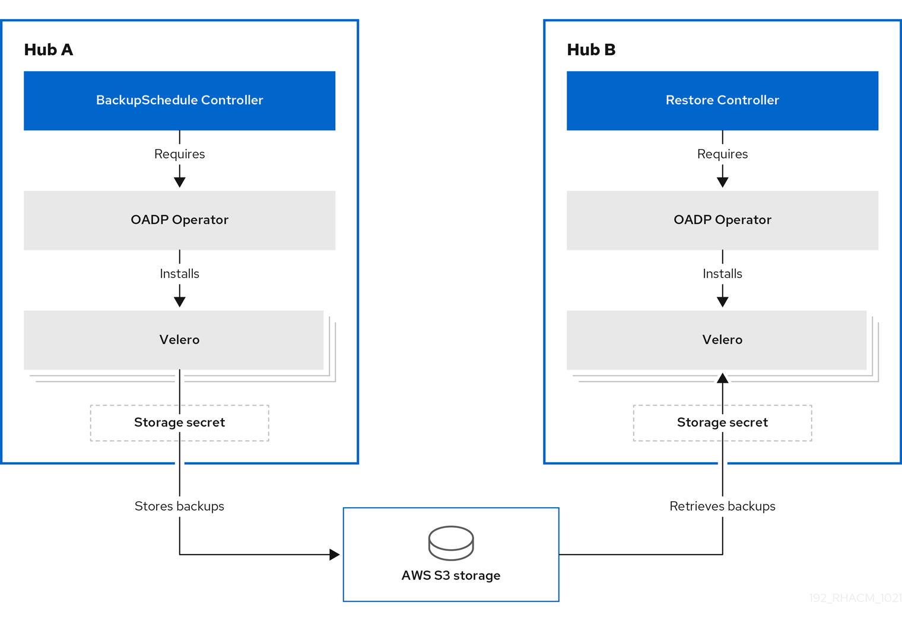

[#hub-backup-and-restore]
= Backup and restore (Technology preview)

//how is the operator referenced in the console? Checking for capitalization consistency

The Cluster Backup and Restore Operator runs on the hub cluster, and depends on the link:https://github.com/openshift/oadp-operator[OADP Operator] to install link:https://velero.io/[Velero] on the {product-title} hub cluster; Velero is used to backup and restore {product-title-short} hub cluster resources. 

**Required access**: Cluster administrator 

[#prerequisites-backup-restore]
== Prerequisites

You must install the OADP Operator. See link:https://github.com/openshift/oadp-operator/blob/master/docs/install_olm.md[Install OADP Operator using OperatorHub]. Be sure to complete the steps to link:https://github.com/openshift/oadp-operator/blob/master/docs/install_olm.md#create-credentials-secret[create the secret] for the cloud storage, where the backups are saved. Then use the created secret when you create the link:https://github.com/openshift/oadp-operator#creating-velero-cr[Velero resource]

// I am currently using the link that was used in the README, is this the correct link? Should we point the user to the Velero repo
//in GH? https://github.com/vmware-tanzu/velero

**Note**: The Cluster Backup and Restore Operator resources must be created in the same namespace where the OADP Operator is installed.

[#backup-restore-architecture]
== Backup and Restore Operator architecture

The operator defines the `backupSchedule.cluster.open-cluster-management.io` resource, which is used to set up {product-title-short} backup schedules, and `restore.cluster.open-cluster-management.io` resource, which is used to process and restore these backups. The operator creates corresponding Velero resources, and defines the options needed to backup remote clusters and any other hub cluster resources that need to be restored. View the following diagram:

// 

// submitted a diagram request form 09/28

[#schedule-backup]
=== Schedule a cluster backup

After you create a `backupschedule.cluster.open-cluster-management.io` resource you can run the following command to get the status of the scheduled cluster backups: `oc get bsch -n <oadp-operator-ns>`. The `<oadp-operator-ns>` is the namespace where `BackupSchedule` is created and must be in the same namespace where the OADP Operator is installed.

The `backupSchedule.cluster.open-cluster-management.io` resource creates the following three `schedule.velero.io` resources:

* `acm-managed-clusters-schedule`: This resource is used to schedule backups for the managed cluster resources, including managed clusters, cluster pools, and cluster sets.
+
**Notes**:
+
** Only managed clusters created using the `hive` API is automatically imported when the backup is restored on another hub cluster. All other managed clusters show up as _Pending Import_ and must be imported back on the new hub cluster.
** When you restore a backup on a new hub cluster, make sure that the previous hub cluster, where the backup was created, is shut down. Otherwise the previous hub cluster tries to reimport the managed clusters as soon as the managed cluster reconciliation finds that the managed clusters are no longer available.
** The following resources are being retrieved by this backup; they are required for restoring all managed clusters information on the new hub cluster:
+
*** Secrets and ConfigMaps from the `hive` and `openshift-operator-lifecycle-manager` namespaces, and from all the `ManagedClusters resources` namespaces created on the hub cluster.
*** Cluster-level `ManagedCluster` resource.
*** Other namespace-scoped resources used to restore the following managed cluster details: `ServiceAccount`, `ManagedClusterInfo`, `ManagedClusterSet`, `ManagedClusterSetBindings`, `KlusterletAddonConfig`, `ManagedClusterView`, `ClusterPool`, `ClusterProvision`, `ClusterDeployment`, `ClusterSyncLease`, `ClusterSync`, `ClusterCurator`.

* `acm-credentials-schedule`: This resource is used to schedule backups for the user created credentials and any copy of those credentials. These credentials are identified by the `cluster.open-cluster-management.io/type` label selector; all secrets that define the label selector are included in the backup.
+
**Note**: If you have any user defined private channels, you can include the channel secrets in this credentials backup if you set the `cluster.open-cluster-management.io/type` label selector to this secret. Without this, channel secrets retrieved by the cluster backup and needs to be recreated on the restored cluster.

* `acm-resources-schedule`: This resource is used to schedule backups for the `Applications` and `Policy` resources, including any required resources, such as: `Channels`, `Subscriptions`, `Deployables` and `PlacementRules` for `Applications` and `PlacementBindings`, `Placement`, `PlacementDecisions` for `Policy`. There are no resources being collected from the `local-cluster` or `open-cluster-management` namespaces.

[#restore-backup]
=== Restore a backup

In a usual restore scenario, the hub cluster where the backups are ran becomes unavailable, and the backed up data needs to be moved to a new hub cluster. This is done by running the cluster restore operation on the new hub cluster. In this case, the restore operation runs on a different hub cluster than the one where the backup was created.

There are also cases where you want to restore the data on the same hub cluster where the backup was collected, so that the data from a previous snapshot can be recovered. In this case, both restore and backup operations are run on the same hub cluster.

After you create a `restore.cluster.open-cluster-management.io` resource on the hub cluster, you can run the following command to get the status of the restore operation: `oc get restore -n <oadp-operator-ns>`. You should also be able to verify the status of your hub cluster that the backed up resources contained, with the backup file that was created.

**Note**: The `restore.cluster.open-cluster-management.io` resource is run once. When the restore operation is complete you have to create a new `restore.cluster.open-cluster-management.io` resource. Optionally, you can run another restore operation on the same hub cluster after the restore operation is completed. 

The restore operation is used to restore all three backup types that are created by the backup operation. However, you can choose to install only a certain type of backup (only managed clusters, only user credentials, or only hub cluster resources).

The restore defines the followiing three required `spec` properties, where the restore logic is defined for the types of backed up files:

* `veleroManagedClustersBackupName` is used to define the restore option for the managed clusters.
* `veleroCredentialsBackupName` is used to define the restore option for the user credentials.
* `veleroResourcesBackupName` is used to define the restore option for the hub cluster resources (`Applications` and `Policy`).
+
The valid options for the previously mentioned properties are following values:
+
** `latest` - This property restores the last available backup file for this type of backup.
** `skip` - This property does not attempt to restore this type of backup with the current restore operation.
** `<backup_name>` - This property restores the specified backup pointing to it by name. 

View the following YAML sample of the operator:

[source,yaml]
----
apiVersion: cluster.open-cluster-management.io/v1beta1
kind: Restore
metadata:
  name: restore-acm
spec:
  veleroManagedClustersBackupName: latest
  veleroCredentialsBackupName: latest
  veleroResourcesBackupName: latest
----

Learn how to install and manage the cluster Backup and Restore Operator, see xref:../clusters/backup_restore_install.adoc#backup-restore-insall[Installing the backup and restore operator].

 

