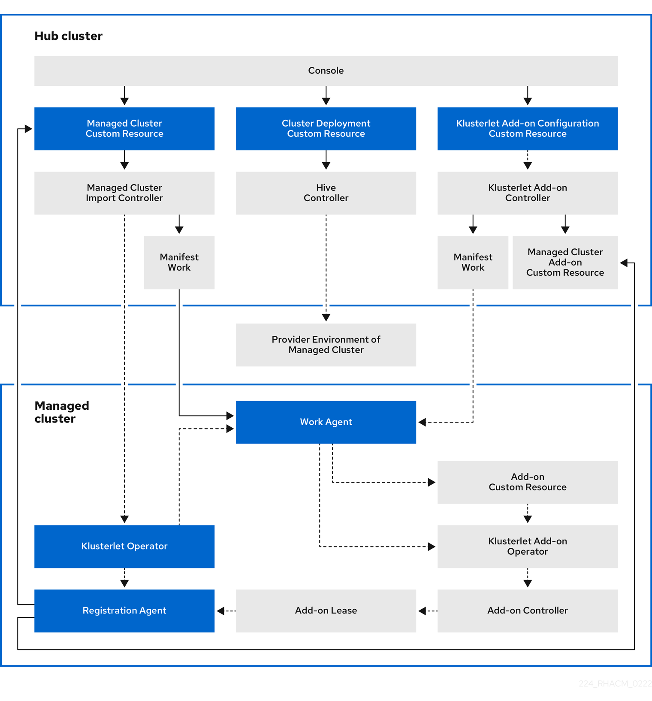

[#cluster-lifecycle-architecture]
= Cluster lifecycle architecture

{product-title} has two main types of clusters: _hub clusters_ and _managed clusters_. 

The hub cluster is the main cluster with {product-title} installed on it. You can create, manage, and monitor other Kubernetes clusters with the hub cluster. The managed clusters are Kubernetes clusters that are managed by the hub cluster. You can create some clusters by using the {product-title-short} hub cluster, while you can also import existing clusters to be managed by the hub cluster.

When you create a managed cluster using {product-title-short}, the cluster is created using the {ocp} cluster installer with the Hive resource. You can find more information about the process of installing clusters with the {ocp-short} installer by reading https://access.redhat.com/documentation/en-us/openshift_container_platform/4.11/html/installing/ocp-installation-overview[OpenShift Container Platform installation overview] in the {ocp-short} documentation.  

The following diagram shows the components that are installed with {product-title-short} for cluster management:

 

The components of the cluster lifecycle management architecture include the following items:

[#components-hub]
== Hub cluster

* The _console_ provides a web-based interface to manage the cluster lifecycle of the {product-title-short} managed clusters.
* The _Hive controller_ provisions the clusters that you create with {product-title-short}. The Hive Controller also detaches and destroys managed clusters that were created by {product-title-short}.
* The _managed cluster import controller_ deploys the klusterlet operator to the managed clusters.
* The _klusterlet add-on controller_ deploys the klusterlet add-on operator to managed clusters.

[#components-managed]
== Managed cluster

* The _klusterlet operator_ deploys the registration and work controllers on the managed cluster.

* The _Registration Agent_ registers the managed cluster with the hub cluster. The following permissions are automatically created to allow the managed cluster to access the hub cluster:
+
** Clusterrole
+
*** Allows the agent to rotate its certificate
+
*** Allows the agent to `get`/`list`/`update`/`watch` the clusters that the hub cluster manages
+
*** Allows the agent to update the status of the clusters that the hub cluster manages

** Role created in the hub cluster namespace of the hub cluster
+
*** Allows the managed cluster Registration Agent to `get` or `update` the `coordination.k8s.io` lease 
+
*** Allows the agent to `get`/`list`/`watch` the managed cluster add-on
+
*** Allows the agent to update the status of managed cluster add-ons

* The _work agent_ applies the manifest work to the managed cluster. The following permission is automatically created to allow the managed cluster to access the hub cluster:
+
** Role created in the hub cluster namespace of the hub cluster
+
*** Allows the Work Agent to send events to the hub cluster 
+
*** Allows the agent to `get`/`list`/`watch`/`update` the `manifestworks` resource
+
*** Allows the agent to update the status of `manifestworks` resource 
