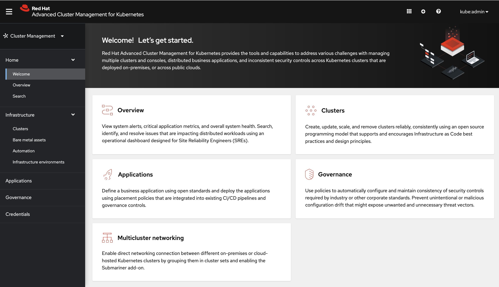

[#console-overview]
= Console overview

Learn more about console components that you can use to view, manage, or customize your console.

See the following image of the _Navigation_ from the {product-title} console, which is described in more detail later in each section. See that the navigation represents major production function.

[#console-components]
== Console components

* <<ocp-plug-ins,{ocp-short} console plug-ins>>
* <<home-page,Home>>
* <<infrastructure-nav,Infrastructure>>
* <<applications-nav,Applications>>
* <<governance-nav,Governance>>
* <<credentials-nav,Credentials>>

[#ocp-plug-ins]
== {ocp-short} console plug-ins

With {ocp-short} 4.10 and {product-title-short} 2.5, {product-title-short} web console can be integrated into the {ocp-short} console. To use this feature, the console plug-ins must remain enabled and accessed from the _All Clusters_ view.

For new installations, the console plug-ins are enabled by default. If you upgraded from a previous version of {product-title-short} and want to enable the plug-ins, or if you want to disable the plug-ins, see the following instructions:

. To disable the plug-in, be sure you are in the _Administrator_ perspective in the {ocp-short} console.
. Find *Administration* in the navigation and click *Cluster Settings*, then click _Configuration_ tab. 
. From the list of _Configuration resources_, click the **Console** resource with the `operator.openshift.io` API group, which contains cluster-wide configuration for the web console. 
. Click on the _Console plug-ins_ tab. Both the `acm` and `mce` plug-ins are listed. 
. Modify plug-in status from the table. In a few moments, you are prompted to refresh the console.

For {ocp-short} 4.10 with the plug-ins enabled, you can access {product-title-short} within the {ocp-short} console from the cluster switcher by selecting *All Clusters* from the drop-down menu. Without plug-ins enabled on {ocp-short} versions 4.8 through 4.10, {product-title-short} is available in the perspective switcher.

You can also click *Networking* > *Routes* to access the standalone or separate {product-title-short} web console.

[#home-page]
== Home

From the {product-title} _Home_ page, you get more information about the product and you can access header features, as well as the pages for the major components of the product. 

- Access the _Welcome_ page and the _Overview_, which gives you visibility into your clusters.
+
You can view the following information about your clusters on the _Overview_ dashboard:
+
* Metric data from your managed clusters by selecting the Grafana link 
* Cluster, node, and pod counts across all clusters and for each provider
* Cluster status
* Cluster compliance
* Pod status

- Select *Grafana* to access the Grafana dashboard. 

- Click *Add provider connections* to access the _Clusters_ page.

_Search_ is also available from the _Home_ tab. To learn about Search, see xref:../console/search.adoc#search-in-the-console[Search in the console].

[#infrastructure-nav]
== Infrastructure

From _Clusters_, you can create new clusters or import existing clusters. From _Automation_, you can create an Ansible template.

For more information about managing clusters, see link:../clusters/intro.adoc#managing-your-clusters-with-red-hat-advanced-cluster-management-for-kubernetes[Managing your clusters with {product-title}].

Additionally, see specific information on these cluster types at link:../clusters/bare_assets.adoc#creating-and-modifying-bare-metal-assets[Creating and modifying bare metal assets] and link:../clusters/ansible_config_cluster.adoc#ansible-config-cluster[Configuring Ansible Tower tasks to run on managed clusters].

[#applications-nav]
== Applications

Create an application and edit a `.yaml` file. Access an overview or more advanced information about each application. For more information about application resources, see link:../applications/app_management_overview.adoc#managing-applications[Managing applications].

[#governance-nav]
== Governance

Create and edit a `.yaml` file to create a policy. Use the _Governance_ dashboard to manage policies and policy controllers.  

For more information, see link:../governance/grc_intro.adoc[Governance].

[#credentials-nav]
== Credentials

The credential stores the access information for a cloud provider. Each provider account requires its own credential, as does each domain on a single provider.

Review your credentials or add a credential.

See link:../credentials/credential_intro.adoc[Managing credentials overview] for more specific information about providers and credentials.
