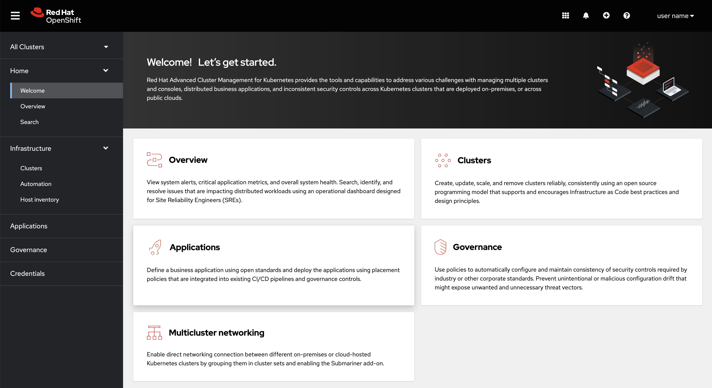

[#console-overview]
= Console overview

Learn more about console components that you can use to view, manage, or customize your console.

See the following image of the _Navigation_ from the {product-title} console, which is described in more detail later in each section. See that the navigation represents major production function.

[#console-components]
== Console components

* <<home-page,Home>>
* <<infrastructure-nav,Infrastructure>>
* <<applications-nav,Applications>>
* <<governance-nav,Governance>>
* <<credentials-nav,Credentials>>

[#home-page]
== Home

From the {product-title} _Home_ page, you can access more information and you can search across the product. 

Click *Welcome* for introductory information about each product function. Click *Overview* to see updates, such as _Application_ status, or to access clickable _Cluster_ percentage values for policy violations and more.

From the _Overview_ page, you can view the following information:

* Cluster and node counts across all clusters and for each provider
* Cluster status
* Cluster compliance
* Pod status
* Cluster add-ons

You can also access all APIs from the integrated console. From the `local-cluster` view, navigate to *Home* > *API Explorer* to explore API groups.

You can also use the _Fleet view_ switch from the _Overview_ page header to filter the page data by using cluster labels, and display metrics. If observability is enabled, alert and failing operator metrics from across your fleet are displayed.

To learn about Search, see link:../observability/search_intro.adoc#searching-in-the-console-intro[Searching in the console introduction].

[#infrastructure-nav]
== Infrastructure

From _Clusters_, you can create new clusters or import existing clusters. From _Automation_, you can create an Ansible template.

For more information about managing clusters, see link:../clusters/cluster_lifecycle/cluster_lifecycle_intro.adoc#cluster-overview[The multicluster engine operator cluster lifecycle overview].

Additionally, see specific information on these cluster types at link:../clusters/cluster_lifecycle/ansible_config_cluster.adoc#ansible-config-cluster[Configuring {aap-short} tasks to run on managed clusters].

[#applications-nav]
== Applications

Create an application and edit a `.yaml` file. Access an overview or more advanced information about each application. For more information about application resources, see link:../applications/app_management_overview.adoc#managing-applications[Managing applications].

[#governance-nav]
== Governance

Create and edit a `.yaml` file to create a policy. Use the _Governance_ dashboard to manage policies and policy controllers.  

For more information, see link:../governance/grc_intro.adoc[Governance].

[#credentials-nav]
== Credentials

The credential stores the access information for a cloud provider. Each provider account requires its own credential, as does each domain on a single provider.

Review your credentials or add a credential.

See link:../clusters/credentials/credential_intro.adoc[Managing credentials overview] for more specific information about providers and credentials.
