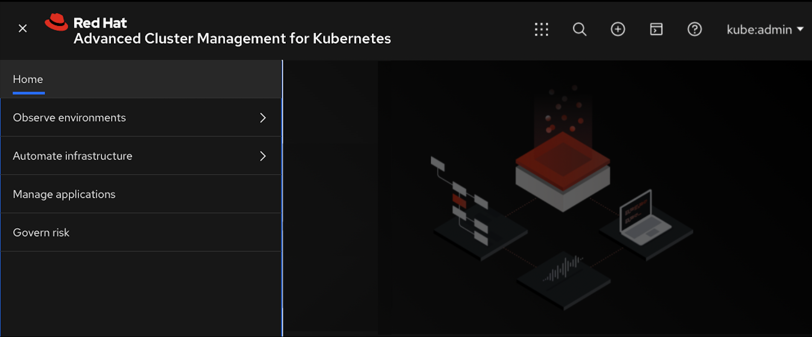

[#observability-in-the-console]
= Observability in the console

Learn more about console components that you can use to view, manage, or customize your console. 

See the following image of the _Navigation_ from the {product-title} console, which is decsribed in more detail later in each section. See that the navigation represents major production function.

[#console-components]
== Console components

* <<access-your-console,Access your console>>
* <<welcome-page,Welcome page>>
* <<observe-environment-details,Observe environment details>>
* <<automate-infrastructure,Automate Infrastructure>>
* <<manage-applications,Manage applications>>
* <<topology-page,Topology page>>
* <<governance-and-risk-dashboard,Governance and risk dashboard>>

To learn about Search, see xref:../console/search.adoc#search-in-the-console[Search in the console]

[#access-your-console]
== Access your console

* Access from the Red Hat OpenShift console:
 .. From the left-hand navigation, click *Networking* > *Routes*
 .. From the _Project_ menu, select the namespace where {product-title} is installed.
 .. Find `multicloud-console` and click the URL from the `Location` column.
* Access the console from the Red Hat OpenShift CLI:
 .. While logged in to OpenShift, run the following command to find the route, where `<namespace-from-install>` is the namespace where you installed {product-title}:

+
----
oc get routes -n <namespace-from-install>
----
 .. Find the `multicloud-console` name and the `Host/Port` columns to get your URL.

[#welcome-page]
== Welcome page

From the {product-title} Welcome page, you get more information about the product and you can access header features, such as _Search_ and _Create resource_.
When you select _Create resource_, you can create a YAML file or JSON file for a deployment. Also from the _Header_, you can click the *Help* (?) icon to view the _About_ page and the documentation. From the _User_ menu, you can access the _Configure Client_ page. Additionally, you can access the xref:../console/vwt_search.adoc#searching-with-visual-web-terminal[Visual Web Terminal] from the header.

[#observe-environment-details]
== Observe environment details

You can manage cluster and pod information by using dashboard to view the information. For more details, see link:../observability/observe_intro.adoc#observing-environments[Observing environments].

[#filtering-your-results]
=== Filtering your results

You can personalize your view of the page by using the filtering feature. Click *Filter results* to specify what information is displayed on your page.

[#automate-infrastructure]
== Automate infrastructure

Create clusters or import existing clusters. Scale up or down and delete clusters as needed. For more information, see link:../manage_cluster/intro.adoc#managing-your-clusters-with-red-hat-advanced-cluster-management-for-kubernetes[Managing your clusters with {product-title}].

[#manage-applications]
== Manage applications

Click *New application* to edit a `.yaml` file and create your application. Click *Overview* and *Advanced configuration* to view the information of each application. For more information about application resources, see link:../manage_applications/app_management_overview.adoc#managing-applications[Managing applications].

[#viewing-your-pod-health]
=== Viewing your pod health

View the pod health for all of your clusters by expanding the Heatmap.

Click *Show details* to view the map. The size of the color-coordinated boxes represents the number of nodes on your cluster. Hover your cursor over the box to view the response time of your cluster.

[#topology-page]
== Topology page

Use the Topology page to display Kubernetes objects and associated objects within a cluster. For more information, see the link:../observability/observe_intro.adoc#topology-page[Topology page section] in _Observing environments_.

[#governance-and-risk-dashboard]
== Governance and risk dashboard

Use the Governance and risk dashboard to create and manage policies and policy controllers. For more information, see link:../security/grc_intro.adoc[Governance and risk].
