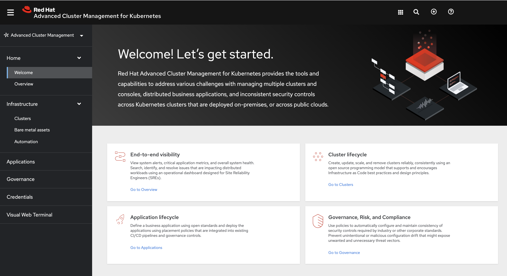

[#console-overview]
= Console overview

Learn more about console components that you can use to view, manage, or customize your console.

See the following image of the _Navigation_ from the {product-title} console, which is described in more detail later in each section. See that the navigation represents major production function.

[#console-components]
== Console components

* <<home-page,Home>>
* <<infrastructure-nav,Infrastructure>>
* <<applications-nav,Applications>>
* <<governance-nav,Governance>>
* <<credentials-nav,Credentials>>
* <<visual-web-nav,Visual Web Terminal>>

To learn about Search, see xref:../console/search.adoc#search-in-the-console[Search in the console]

[#home-page]
== Home

From the {product-title} _Home_ page, you get more information about the product and you can access header features, as well as the pages for the major components of the product. 

- Access the _Welcome_ page and the _Overview_, which gives you visibility into your clusters.

- Select *Grafana* to access the Grafana dashboard. 

- Click *Add provider connections* to access the _Clusters_ page.

[#infrastructure-nav]
== Infrastructure

- From _Clusters, you can create new clusters or import existing clusters. For more information, see link:../clusters/intro.adoc#managing-your-clusters-with-red-hat-advanced-cluster-management-for-kubernetes[Managing your clusters with {product-title}].

- From _Bare metal assets_, you can create and import assets.

- From _Automation_, you can create an Ansible template.

[#applications]
== Applications

Click *Create application* to edit a `.yaml` file and create your application. Click *Overview* and *Advanced configuration* to view the information of each application. For more information about application resources, see link:../applications/app_management_overview.adoc#managing-applications[Managing applications].

[#governance]
== Governance

Use the _Governance_ dashboard to create and manage policies and policy controllers. Click *Create policy* to edit a `.yaml` file and create your application. For more information, see link:../risk_compliance/grc_intro.adoc[Governance].

[#credentials]
== Credentials

View your credentials and click *Add credential* to select and add new cloud provider credentials.

[#visual-web-nav]
== Visual Web Terminal (Technology preview)

Use the Visual Web Terminal to run many commands across your cluster. Run commands and get outputs without leaving the entire console. You can run multiple commands, similar to what you can do in a standard terminal.
