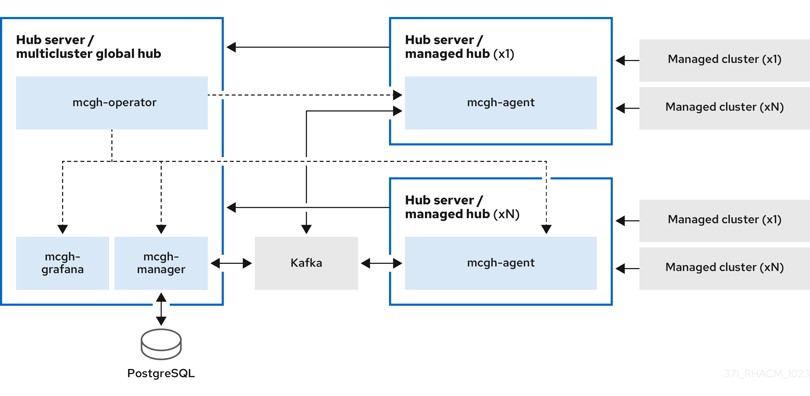

[#global-hub-architecture]
= {global-hub} architecture

The {global-hub} consists of the following components that are used to access and manage your hub clusters:

* A server component called the _global hub cluster_ where the management tools and the console run
* A client component that is installed on {product-title-short}, named the _managed hub_, which can be managed by the global hub cluster. The managed hub also manages other clusters. You do not have to use a dedicated cluster for your {global-hub} cluster.

Learn more about the architecture in the following sections:

//

See the following high-level multicluster terms and components:

* <<global-hub-operator,{global-hub} operator>> 
* <<global-hub-manager,{global-hub} manager>>
* <<global-hub-agent,{global-hub} agent>>
* <<global-hub-visualizations,{global-hub} visualizations>>

[#global-hub-operator]
== The {global-hub} operator

The {global-hub} operator contains the components of {global-hub}. The operator deploys all of the required components for global multicluster management. The components include `multicluster-global-hub-manager`, `multicluster-global-hub-grafana`, and provided versions of `Kafka` and `PostgreSQL` in the {global-hub} cluster and `multicluster-global-hub-agent` in the managed hub clusters.

The operator also leverages the `manifestwork` custom resource to deploy the Red Hat Advanced Cluster Management for Kubernetes operator on the managed cluster. After the Red Hat Advanced Cluster Management operator is deployed on the managed cluster, the managed cluster becomes a standard {product-title-short} cluster. This hub cluster is now a managed hub cluster.

[#global-hub-manager]
== The {global-hub} manager

The {global-hub} manager is used to persist the data into the `postgreSQL` database. The data is from Kafka transport. The manager also posts the data to the Kafka transport, so it can be synchronized with the data on the managed hub clusters.

[#global-hub-agent]
== The {global-hub} agent

The {global-hub} agent runs on the managed hub clusters. It synchronizes the data between the {global-hub} cluster and the managed hub clusters. For example, the agent synchronizes the information of the managed clusters from the managed hub clusters to the {global-hub} cluster and synchronizes the policy or application from the {global-hub} cluster to the managed hub clusters.

[#global-hub-visualizations]
== The {global-hub} visualizations

Grafana runs on the {global-hub} cluster as the main service for {global-hub} visualizations. The PostgreSQL data collected by the Global Hub Manager is its default DataSource. By exposing the service using the route called `multicluster-global-hub-grafana`, you can access the {global-hub} Grafana dashboards by accessing the console.
