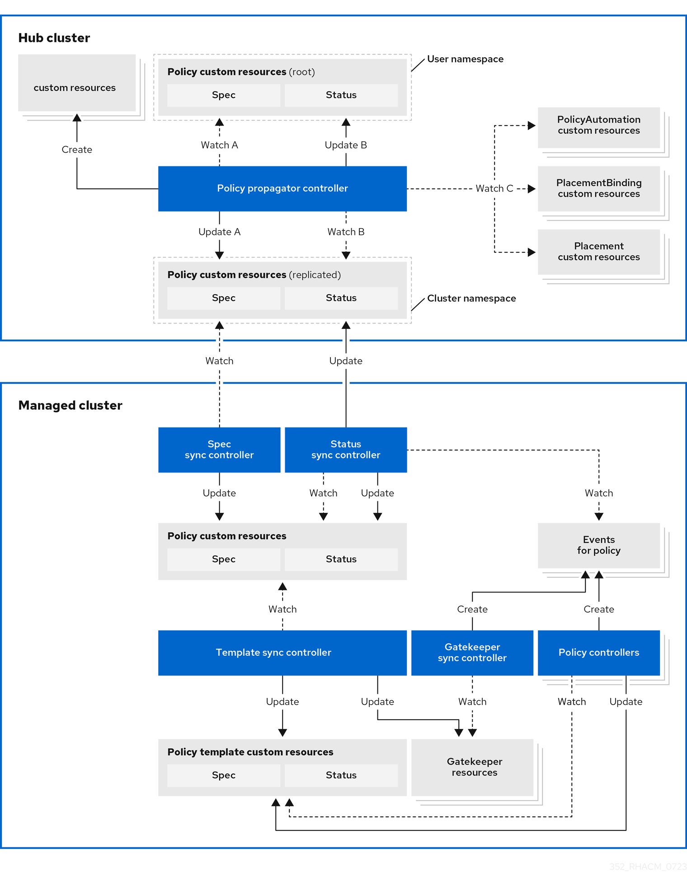

[#governance-architecture]
= Governance architecture

Enhance the security for your cluster with the {product-title} governance lifecycle. The product governance lifecycle is based on using supported policies, processes, and procedures to manage security and compliance from a central interface page. View the following diagram of the governance architecture:

 

View the following component descriptions for the governance architecture diagram:

- *Policy propagator controller:* Evaluates one or more policies on the managed cluster against your specified control and generates Kubernetes events for violations. Violations are propagated to the hub cluster. The following policy controllers are included in your installation, Kubernetes configuration and Certificate. Customize the your policy controllers using advanced configurations.

- *Spec sync controller:* Runs on your managed clusters and watches for policy changes to intiate the reconcile process in the cluster namespace of the hub cluster. Every reconcile modifies the `spec` of the replicated policies on the managed cluster to match the `spec` from the hub cluster.

- *Status sync controller:* Runs on managed clusters and watches for the following causes to initiate the reconcile process:
+
* Changes to policies in the watched cluster namespace on the managed cluster.
* Generated events on policies in the watched cluster namespace on the managed cluster.
* During each reconcile, the controller creates and updates the policy status for the hub cluster and managed cluster in the cluster namespace, based on the policy changes or generated events.

- *Template sync controller:* Runs on your managed clusters and watches for template function changes for policies in the cluster namespace on the managed cluster. The changes start the reconcile process, and for each reconcile, it creates,updates, and deletes objects defined in the `spec.policy-templates` of the policies.

- *Gatekeeper sync controller:* The Gatekeeper sync controller runs on your managed clusters and watches for Gatekeeper constraints in {product-title-short} policies. It then updates the policy status with the Gatekeeper constraint audit results.

[#gov-arch-components]
== Governance architecture components

The governance architecture also include following components:

* *Governance dashboard:* Provides a summary of your cloud governance and risk details, which include policy and cluster violations. Refer to the _Manage Governance dashboard_ section to learn about the structure of an {product-title} policy framework, and how to use the {product-title} _Governance_ dashboard.
+
*Notes:*  
+
** When a policy is propagated to a managed cluster, it is first replicated to the cluster namespace on the hub cluster, and is named and labeled using `namespaceName.policyName`. When you create a policy, make sure that the length of the `namespaceName.policyName` does not exceed 63 characters due to the Kubernetes length limit for label values.

** When you search for a policy in the hub cluster, you might also receive the name of the replicated policy in the managed cluster namespace. For example, if you search for `policy-dhaz-cert` in the `default` namespace, the following policy name from the hub cluster might also appear in the managed cluster namespace: `default.policy-dhaz-cert`.

* *Policy-based governance framework:* Supports policy creation and deployment to various managed clusters based on attributes associated with clusters, such as a geographical region. There are examples of the predefined policies and instructions on deploying policies to your cluster in the _open source community_. Additionally, when policies are violated, automations can be configured to run and take any action that the user chooses. 

* *Open source community:* Supports community contributions with a foundation of the {product-title-short} policy framework. Policy controllers and third-party policies are also a part of the link:https://github.com/open-cluster-management/policy-collection[`open-cluster-management/policy-collection` repository]. You can contribute and deploy policies using GitOps. 

[#additional-resources-gov-arch]
== Additional resources

- See link:../gitops/deploy_gitops.adoc#gitops-deploy-policies[Deploying policies by using GitOps].
