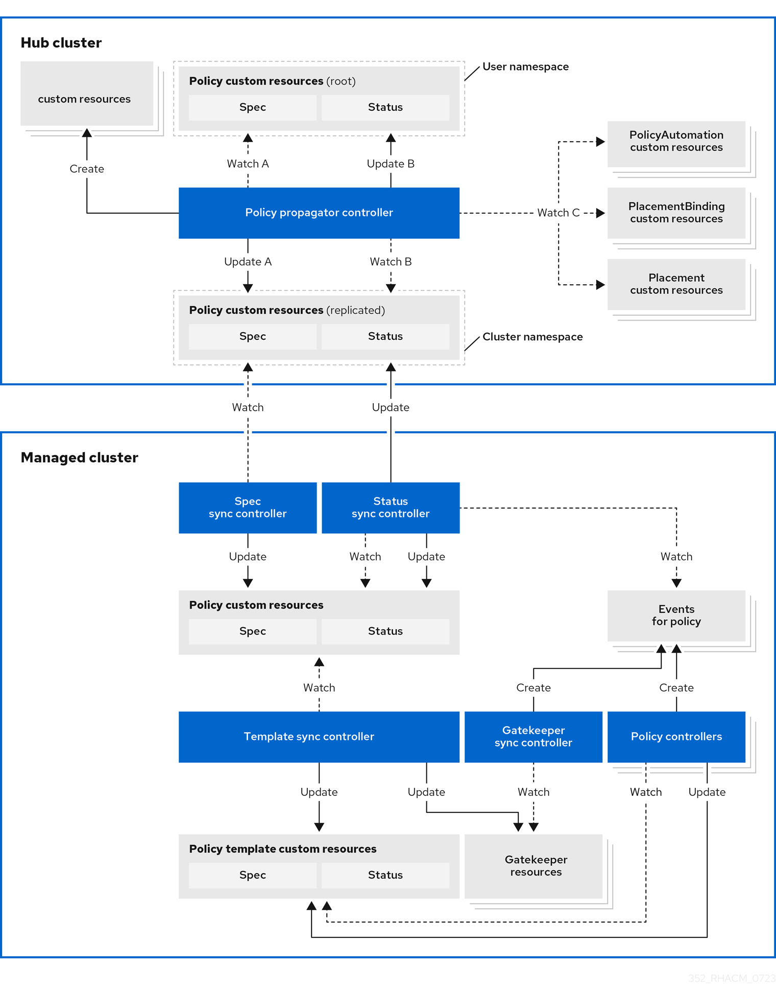

:_mod-docs-content-type: CONCEPT

[#governance-architecture]
= Governance policy framework architecture

[role="_abstract"]
Enhance cluster security with the {acm} governance lifecycle. The governance lifecycle uses supported policies, processes, and procedures to manage security and compliance from a central interface.

The following diagram shows the governance architecture:

* Governance architecture components:

** *Governance dashboard:* Provides a summary of your cloud governance and risk details, which include policy and cluster violations. See _Governance dashboard_ to learn about the structure of an {acm} policy framework and how to use the {acm} _Governance_ dashboard.

** *Policy-based governance framework:* Supports policy creation and deployment to various managed clusters based on attributes associated with clusters, such as a geographical region. Predefined policy examples and deployment instructions are available in the _policy-collection_ repository. When a policy becomes noncompliant, you can configure policy violation automation to run an action of your choice.

** *Open source community:* Supports community contributions with a foundation of the {acm-short} policy framework. Policy controllers and third-party policies are also part of the `open-cluster-management-io` project. You can contribute and deploy policies by using GitOps.

.Additional resources

* xref:../governance/grc_dashboard.adoc#grc-dashboard[Governance dashboard]
* link:https://github.com/open-cluster-management-io/policy-collection[policy-collection]
* xref:../governance/policy_controllers_intro.adoc#policy-controllers[Policy controllers introduction]
* link:../gitops/deploy_gitops.adoc#gitops-deploy-policies[Deploying policies by using GitOps]
