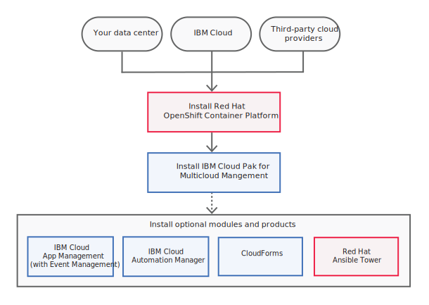

---

copyright:
  years: 2019, 2020
lastupdated: "2020-03-12"

---

{:new_window: target="_blank"}
{:shortdesc: .shortdesc}
{:screen: .screen}
{:codeblock: .codeblock}
{:pre: .pre}
{:child: .link .ulchildlink}
{:childlinks: .ullinks}

# Red Hat Advanced Cluster Management for Kubernetes installation

This section provides all the details to install and validate, uninstall, and upgrade your installation of Red Hat Advanced Cluster Management for Kubernetes.
{:shortdesc}

Before you install the Red Hat Advanced Cluster Management for Kubernetes, review the required hardware and system configuration for each product.

You can install the Red Hat Advanced Cluster Management for Kubernetes either online or offline on Linux, and Linux on Power (ppc64le) with a supported version of OpenShift Container Platform.

High-level installation flow:

1. You must have a supported version of OpenShift Container Platform installed on premise.
2. Complete either an offline or online installation:
3. Optionally, install modules or products that you require for your cluster.

After you install and deploy the Red Hat Advanced Cluster Management for Kubernetes, view the documentation on how to use the many features in each of the components.

   - {: child} [System requirements](requirements.md)
   - {: child} [Preparing for installation](prep.md)
   - {: child} [Offline](offline.md)
   - {: child} [Online](online.md)
   - {: child} [Configuration options](config_install.md)
   {: childlinks}
