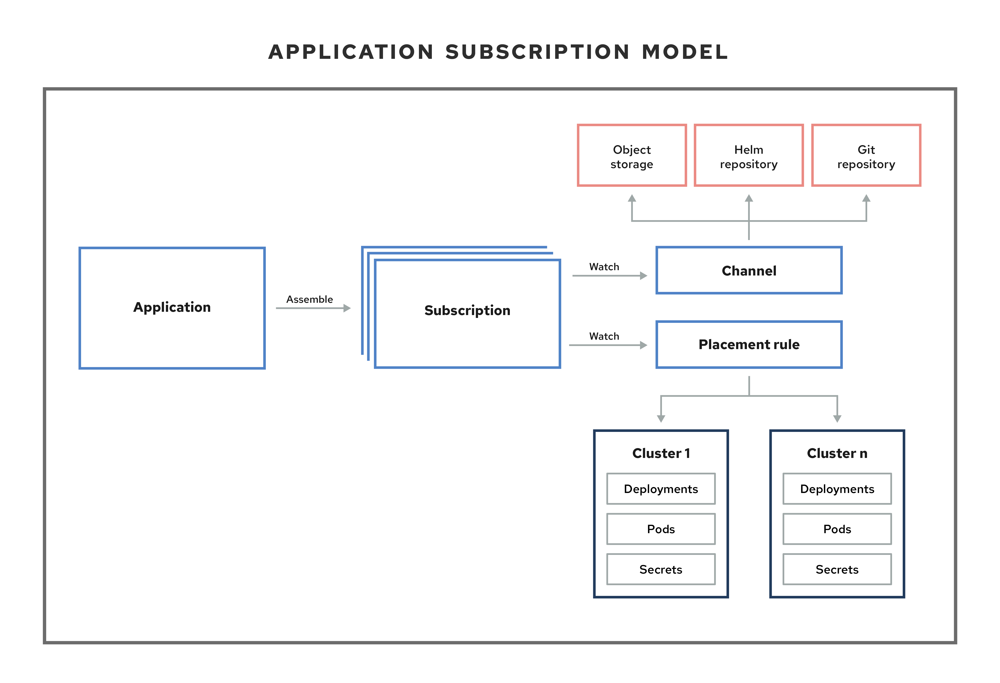

[#application-model-and-definitions]
= Application model and definitions

The application model is based on subscribing to one or more Kubernetes resource repositories (_channel_ resources) that contains resources that are deployed on managed clusters. Both single and multi-cluster applications use the same Kubernetes specifications, but multi-cluster applications involve more automation of the deployment and application management lifecycle.

All of the application component resources for {product-title} applications are defined in YAML file spec sections.
When you need to create or update an application component resource, you need to create or edit the appropriate spec section to include the labels for defining your resource.

[#application-secrets]
== Application secrets

* Secrets are Kubernetes resources that you can use to store authorization and other sensitive information, such as passwords, OAuth tokens, and SSH keys. By storing this information as secrets, you can separate the information from the application components that require the information to improve your data security. 

If you have applications that require secret resources to operate, you can use subscriptions to deploy the secrets to the managed clusters where the resources are needed.

If you have applications that require Kubernetes resources or Helm charts from channels that require authorization, such as entitled Git repositories, you can use secrets to provide access to these channels. Your subscriptions can access Kubernetes resources and Helm charts for deployment from these channels, while maintaining data security.

The _subscription_ component uses a _placement rule_ resource to define the managed clusters where the Kubernetes resource will be deployed.

The last piece in the application model is the _application_ resource that references one or more repositories subscriptions. The purpose for the application is to group deployed Kubernetes resources and provide data aggregation that is easy to understand and manage.

The Application model consists of the following Kubernetes custom resources: channels, subscriptions, placement rules, and applications.

Within {product-title}, applications are composed of multiple application resources. You can use channels, subscriptions, and placement rule resources to help you deploy, update, and manage your overall applications. See the following image to understand mroe about the application model:

View the following application resource sections:

[#channels]
== Channels

* Channels (`channel.apps.open-cluster-management.io`) define the source repositories that a cluster can subscribe to with a subscription, and can be the following types: Git, Helm release, and Object storage repositories, and resource templates on the hub cluster.

Channels use a namespace within the hub cluster and point to a physical place where resources are stored for deployment. Clusters can subscribe to channels for identifying the resources to deploy to each cluster.

**Note:** It is best practice to create each channel in a unique namespace. However, a Git channel can share a namespace with another type of channel, including Git, Helm, and Object storage.

*Note:* Resources within a channel can be accessed by only the clusters that subscribe to that channel.

[#subscriptions]
== Subscriptions

Subscriptions (`subscription.apps.open-cluster-management.io`) allow clusters to subscribe to a source repository (channel) that can be the following types: Git repository, Helm release registry, or Object storage repository. Subscriptions can be applied locally to the hub cluster or to managed clusters.

Subscriptions can point to a channel or storage location for identifying new or updated resource templates. The subscription operator can then download directly from the storage location and deploy to targeted managed clusters without checking the hub cluster first. With a subscription, the subscription operator can monitor the channel for new or updated resources instead of the hub cluster.

[#placement-rules]
== Placement rules

Placement rules (`placementrule.apps.open-cluster-management.io`) define the target clusters where resource templates can be deployed. Use placement rules to help you facilitate the multi-cluster deployment of your deployables. Placement policies are also used for governance and risk policies.

[#applications]
== Applications

Applications (`application.app.k8s.io`) in {product-title} are used for grouping Kubernetes resources that make up an application.

Learn more from the following documentation:

* xref:../manage_applications/app_console.adoc#application-console[Application console]
* xref:../manage_applications/app_resources.adoc#managing-application-resources[Managing application resources] 
* xref:../manage_applications/manage_apps_git.adoc#managing-apps-with-git-repositories[Managing apps with Git repositories]
* xref:../manage_applications/manage_apps_helm.adoc#managing-apps-with-helm-cluster-repositories[Managing apps with Helm repositories]
* xref:../manage_applications/manage_apps_object.adoc#managing-apps-with-object-storage-repositories[Managing apps with Object storage repositories]
* xref:../manage_applications/app_advanced_config.adoc#application-advanced-configuration[Application advanced configuration]
* xref:../manage_applications/subscribe_git_resources.adoc#subscribing-git-resources[Subscribing Git resources] 
* xref:../manage_applications/ansible_config.adoc#setting-up-ansible[Setting up Ansible Tower tasks] 
* xref:../manage_applications/channel_sample.adoc#channel-samples[Channel samples]
* xref:../manage_applications/subscription_sample.adoc#subscription-samples[Subscription samples]
* xref:../manage_applications/placement_sample.adoc#placement-rule-samples[Placement rule samples]
* xref:../manage_applications/app_sample.adoc#application-samples[Application samples]
