# Enable observability service using the web console

## Prerequisites

- You must install Red Hat Advanced Cluster Management for Kubernetes.
- You must configure an object store to create a storage solution. Red Hat Advanced Cluster Management only supports cloud providers with stable object stores, such as Amazon S3 (or other S3 compatible object stores like Ceph), Google Cloud Storage, Azure Storage, and OpenShift Container Storage.
  
## Enabling observability

Complete the following steps to enable the observability service using the web console:

1. Log in to your Red Hat Advanced Cluster Management hub cluster console, create the `Project`:

   - Navigate to `Home -> Projects`:

    

        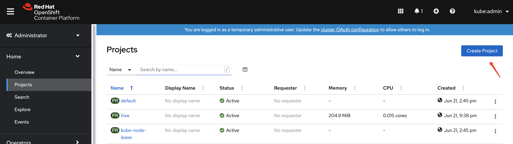
    

   - Click `Create Project` and enter your project name `open-cluster-management-observability`. Click `Create`:

    

        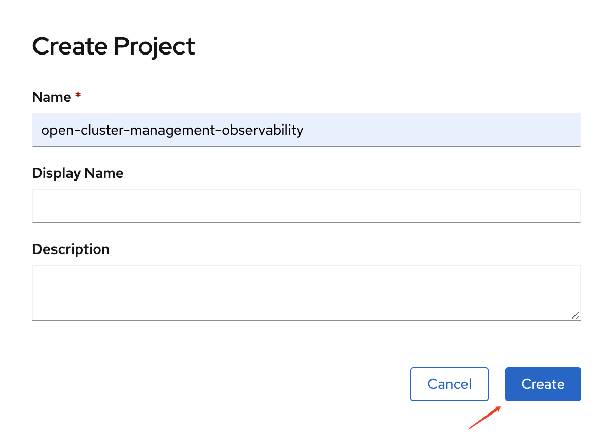
    

    You must use `open-cluster-management-observability` as the project name. Observability service does not support installation to other projects.

2. Create your image pull secret `multiclusterhub-operator-pull-secret` in `open-cluster-management-observability` project:

   - Navigate to `Workloads -> Secrets`. Click `Create -> Image Pull Secret`:

    

        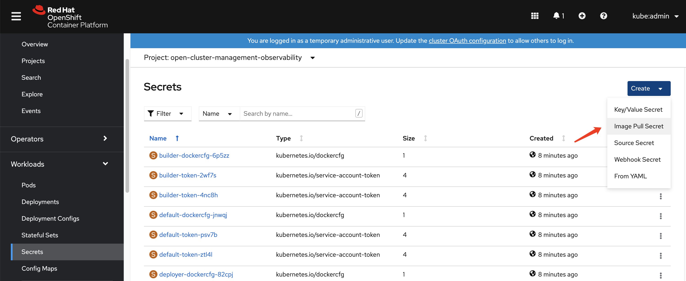
    

   - If Red Hat Advanced Cluster Management is installed in the `open-cluster-management` namespace, you can get the image pull secret from the `open-cluster-management` namespace. Otherwise you can get the image pull secret `pull-secret` from the `openshift-config` namespace. Enter your image pull secret details. Click `Create`:

    

        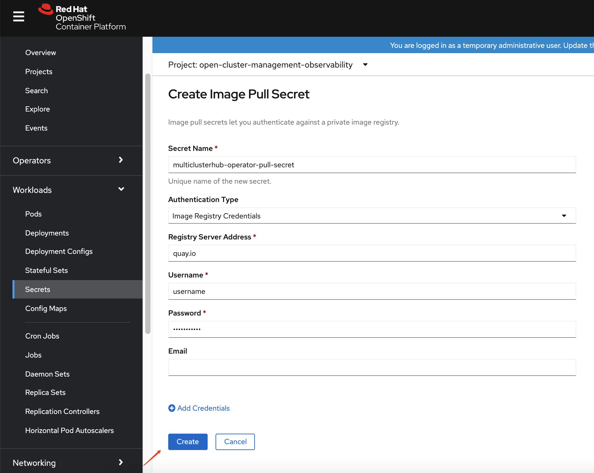
    

3. Create your object storage secret `thanos-object-storage` in `open-cluster-management-observability` project, more details about object storage please refer to the [product page](https://access.redhat.com/documentation/en-us/red_hat_advanced_cluster_management_for_kubernetes/2.2/html/observing_environments/observing-environments-intro#enabling-observability). In this step, we will create a Amazon S3 object storage secret for observability service:

   - Navigate to `Workloads -> Secrets`. Click `Create -> From YAML`:

    

        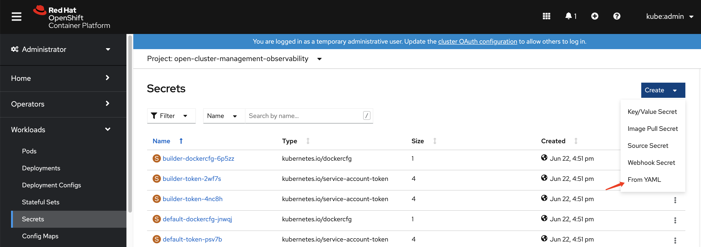
    

   - Enter your object stroage secret details. Click `Create`:

    

        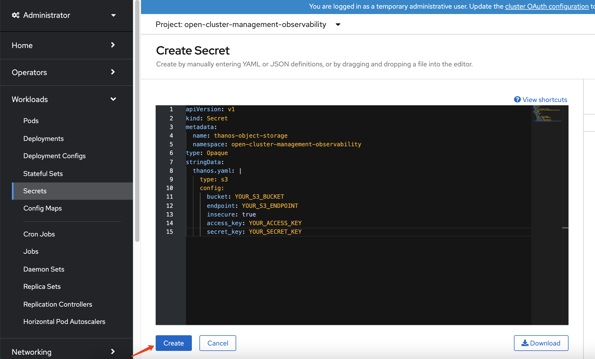
    

4. Create the `MultiClusterObservability` custom resource (CR):

   - Navigate to `Home -> Explore`. Search the `MultiClusterObservability` API resource:

    

        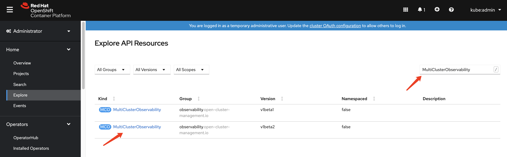
    

   - Click the `v1beta2`  `MultiClusterObservability` API resource:

    

        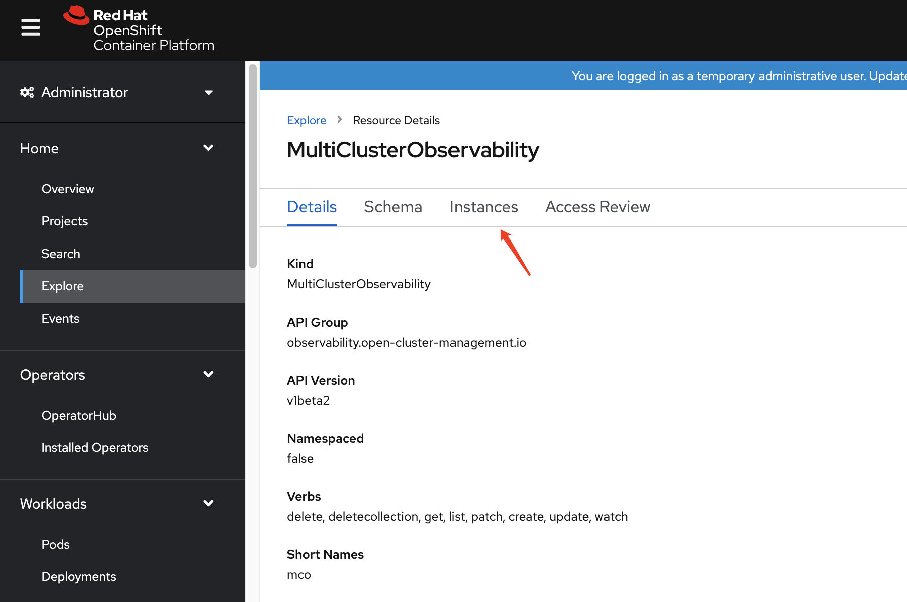
    

   - Click the `Instances -> Create MultiClusterObservability` to create a `MultiClusterObservability` instance:

    

        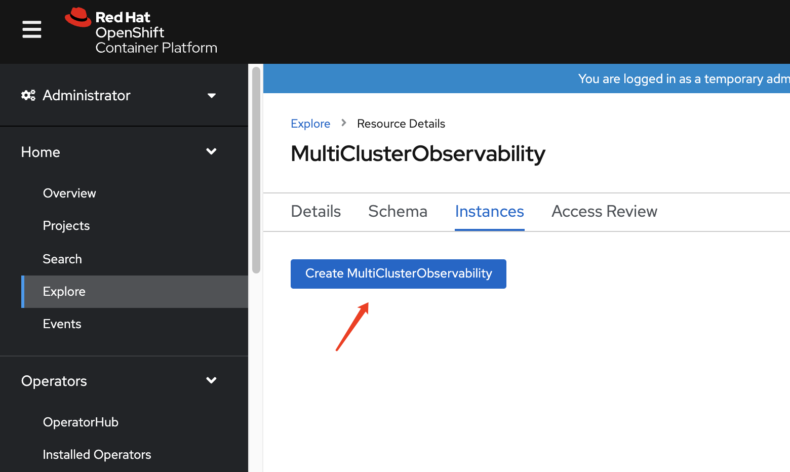
    

   - Enter your `MultiClusterObservability` instance details. Click `Create`:

    

        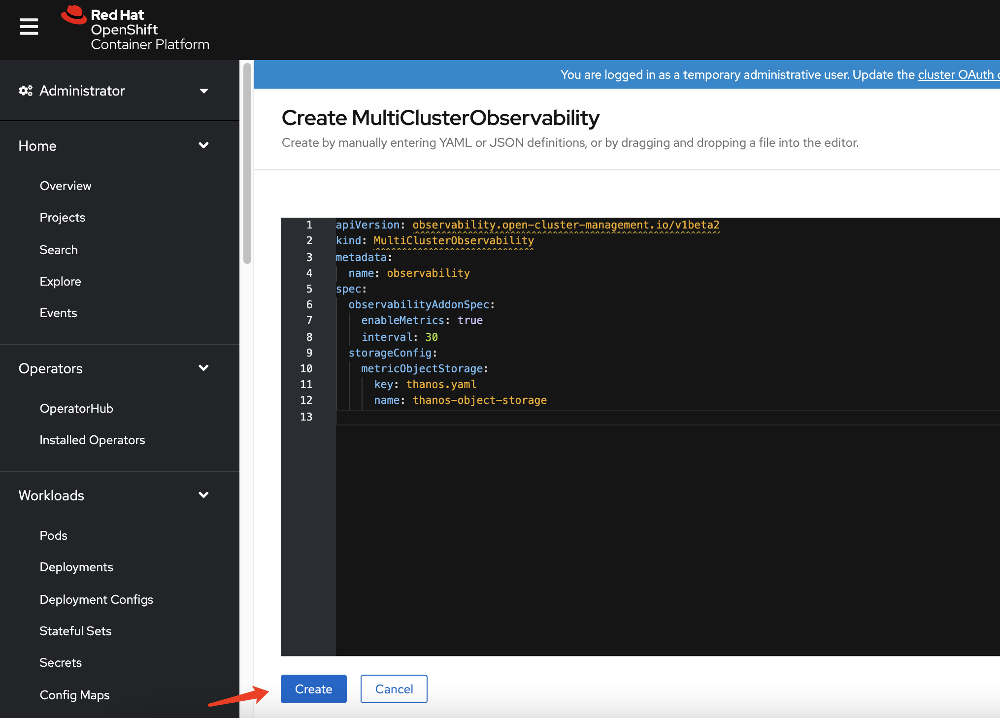
    

   - Check the `MultiClusterObservability` instance status. If you get this message: `Observability components are deployed and running`. Now your observability service has enable successully:

    

        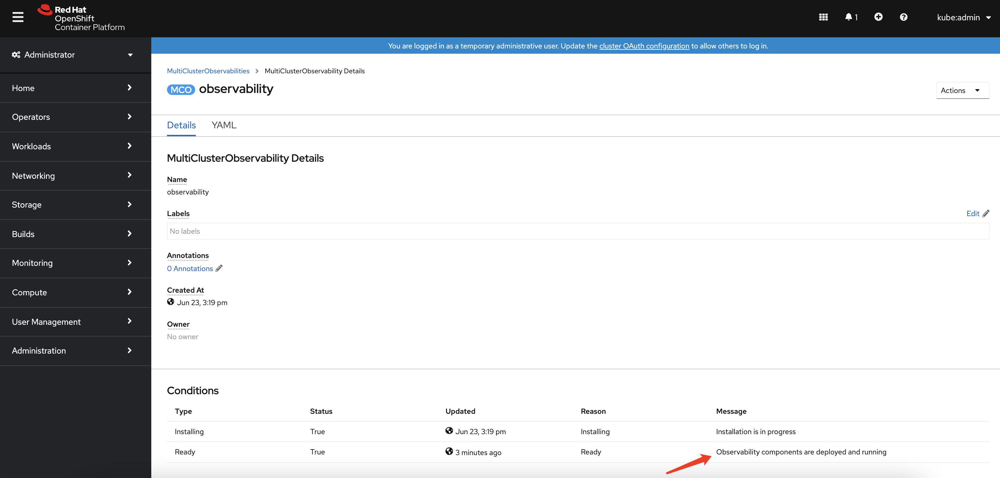
    

