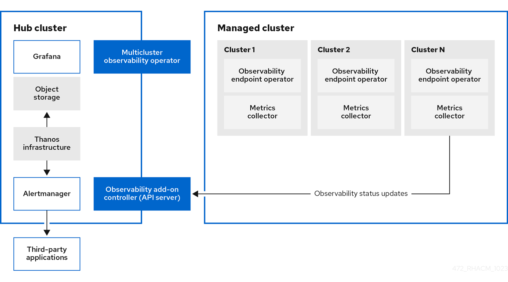

:_mod-docs-content-type: CONCEPT

[#observability-arch]
= Observability architecture

[role="_abstract"]
Learn how the observability operators, Thanos components, Grafana, and Alertmanager work together on the hub and managed clusters.

When the observability service is enabled, the hub cluster is always configured to collect and send metrics to the configured Thanos instance, regardless of whether `disableHubSelfManagement` is set to `true` (enabled) or set to `false` (disabled). When the hub cluster is self-managed as a `local-cluster`, the `disableHubSelfManagement` parameter is set to `false`, which is the default setting. The `multiclusterhub-operator` enables the `multicluster-observability-operator` pod by default. You must configure the `multicluster-observability-operator` pod.

Metrics and alerts for the hub cluster appear in the `<your-local-cluster-name>` namespace. The local cluster is only available if `disableHubSelfManagement` is enabled. You can query the `<your-local-cluster-name>` metrics in the Grafana explorer.

The following diagram shows the components of observability:

The components of the observability architecture include the following items:

* The multicluster hub operator, also known as the `multiclusterhub-operator` pod, deploys the `multicluster-observability-operator` pod. It is the root component that deploys resources for the {acm-short} observability service, such as the metrics store on the hub cluster and collectors on managed clusters through the generation of `ManifestWorks` resources.

* The _observability add-on controller_ is the API server that automatically updates the log of the managed cluster.

* The Thanos infrastructure includes the Thanos Compactor, which is deployed by the `multicluster-observability-operator` pod. The Thanos Compactor ensures that queries are performing well by using the retention configuration, and compaction of the data in storage. To monitor Compactor health, see xref:../observability/obs_thanos_compact_alerts.adoc#obs-thanos-compact-alerts[Thanos Compactor default alerts].

* The observability component deploys an instance of _Grafana_ to enable data visualization with dashboards (static) or data exploration. You can also design your Grafana dashboard. For more information, see xref:../observability/obs_view_grafana.adoc#view-explore-data-grafana[View and explore data with Grafana dashboards].

* The _Prometheus Alertmanager_ enables alerts to be forwarded with third-party applications. You can customize the observability service by creating custom recording rules or alerting rules.

.Additional resources

* xref:../observability/obs_open_source_components.adoc#obs-open-source-components[Observability open source components]
* xref:../observability/obs_component_versions.adoc#obs-component-versions[Observability component versions]
* xref:../observability/obs_thanos_compact_alerts.adoc#obs-thanos-compact-alerts[Thanos Compactor default alerts]
* xref:../observability/obs_persistent_stores.adoc#obs-persistent-stores[Persistent stores used in the observability service]
* xref:../observability/obs_support.adoc#obs-support[Observability support]
* xref:../observability/observability_enable.adoc#enabling-observability-service[Enable the observability service]
* xref:../observability/obs_setup_grafana_instance.adoc#setting-up-grafana-developer-instance[Set up the Grafana developer instance]
* link:../business_continuity/backup_restore/backup_restore_obs.adoc#backup-restore-obs[Backing up and restoring the observability service]
* link:https://thanos.io/v0.36/thanos/getting-started.md/[Thanos documentation]
* link:https://prometheus.io/docs/introduction/overview/[Prometheus Overview]
* link:https://prometheus.io/docs/alerting/latest/alertmanager/[Alertmanager documentation]
