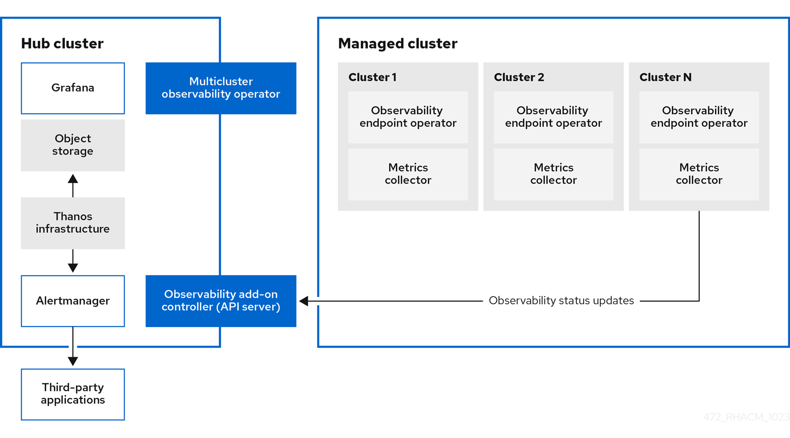

[#observability-arch]
= Observability architecture

The `multiclusterhub-operator` enables the `multicluster-observability-operator` pod by default. You must configure the `multicluster-observability-operator` pod.

When you enable the service, the `observability-endpoint-operator` is automatically deployed to each imported or created cluster. This controller collects the data from {ocp} Prometheus, then sends it to the {product-title-short} hub cluster. If the hub cluster imports itself is self-managed and imports itself as the `local-cluster`, observability is also enabled on it and metrics are collected from the hub cluster. As a reminder, when the hub cluster is self-managed the `disableHubSelfManagement` parameter is set to `false`.
 
The following diagram shows the components of observability:

The components of the observability architecture include the following items:

- The multicluster hub operator, also known as the `multiclusterhub-operator` pod, deploys the `multicluster-observability-operator` pod. It sends hub cluster data to your managed clusters.

- The _observability add-on controller_ is the API server that automatically updates the log of the managed cluster.

- The Thanos infrastructure includes the Thanos Compactor, which is deployed by the `multicluster-observability-operator` pod. The Thanos Compactor ensures that queries are performing well by using the retention configuration, and compaction of the data in storage.
+
To help identify when the Thanos Compactor is experiencing issues, use the four default alerts that are monitoring its health. Read the following table of default alerts:
+
.Table of default Thanos alerts
|===
| Alert | Severity | Description

| `ACMThanosCompactHalted`
| critical
| An alert is sent when the compactor stops.

| `ACMThanosCompactHighCompactionFailures`
| warning
| An alert is sent when the compaction failure rate is greater than 5 percent.

| `ACMThanosCompactBucketHighOperationFailures`
| warning
| An alert is sent when the bucket operation failure rate is greater than 5%.

| `ACMThanosCompactHasNotRun`
| warning
| An alert is sent when the compactor has not uploaded anything in last 24 hours.
|===

- The observability component deploys an instance of _Grafana_ to enable data visualization with dashboards (static) or data exploration. {product-title-short} supports version 8.5.20 of Grafana. You can also design your Grafana dashboard. For more information, see _Designing your Grafana dashboard_.

- The _Prometheus Alertmanager_ enables alerts to be forwarded with third-party applications. You can customize the observability service by creating custom recording rules or alerting rules. {product-title-short} supports version 0.25 of Prometheus Alertmanager.

[#persistent-stores-observability]
== Persistent stores used in the observability service

*Important:* Do not use the local storage operator or a storage class that uses local volumes for persistent storage. You can lose data if the pod relaunched on a different node after a restart. When this happens, the pod can no longer access the local storage on the node. Be sure that you can access the persistent volumes of the `receive` and `rules` pods to avoid data loss.

When you install {product-title-short} the following persistent volumes (PV) must be created so that Persistent Volume Claims (PVC) can attach to it automatically. As a reminder, you must define a storage class in the `MultiClusterObservability` custom resource when there is no default storage class specified or you want to use a non-default storage class to host the PVs. It is recommended to use Block Storage, similar to what Prometheus uses. Also each replica of `alertmanager`, `thanos-compactor`, `thanos-ruler`, `thanos-receive-default` and `thanos-store-shard` must have its own PV. View the following table:

.Table list of persistent volumes
|===
| Persistent volume name | Purpose 
| alertmanager 
| Alertmanager stores the `nflog` data and silenced alerts in its storage. `nflog` is an append-only log of active and resolved notifications along with the notified receiver, and a hash digest of contents that the notification identified.

| thanos-compact 
| The compactor needs local disk space to store intermediate data for its processing, as well as bucket state cache. The required space depends on the size of the underlying blocks. The compactor must have enough space to download all of the source blocks, then build the compacted blocks on the disk. On-disk data is safe to delete between restarts and should be the first attempt to get crash-looping compactors unstuck. However, it is recommended to give the compactor persistent disks in order to effectively use bucket state cache in between restarts.

| thanos-rule 
| The thanos ruler evaluates Prometheus recording and alerting rules against a chosen query API by issuing queries at a fixed interval. Rule results are written back to the disk in the Prometheus 2.0 storage format. The amount of hours or days of data retained in this stateful set was fixed in the API version `observability.open-cluster-management.io/v1beta1`. It has been exposed as an API parameter in `observability.open-cluster-management.io/v1beta2`: `_RetentionInLocal_` 

| thanos-receive-default 
| Thanos receiver accepts incoming data (Prometheus remote-write requests) and writes these into a local instance of the Prometheus TSDB. Periodically (every 2 hours), TSDB blocks are uploaded to the object storage for long term storage and compaction. The amount of hours or days of data retained in this stateful set, which acts a local cache was fixed in API Version `observability.open-cluster-management.io/v1beta`. It has been exposed as an API parameter in `observability.open-cluster-management.io/v1beta2`: `_RetentionInLocal_`

| thanos-store-shard
| It acts primarily as an API gateway and therefore does not need a significant amount of local disk space. It joins a Thanos cluster on startup and advertises the data it can access. It keeps a small amount of information about all remote blocks on local disk and keeps it in sync with the bucket. This data is generally safe to delete across restarts at the cost of increased startup times.
|===

*Note:* The time series historical data is stored in object stores. Thanos uses object storage as the primary storage for metrics and metadata related to them. For more details about the object storage and downsampling, see _Enabling observability service_.

[#obs-arch-additional-resources]
== Additional resources

- See xref:../observability/observe_environments_intro.adoc#observing-environments-intro[Observability service introduction]

- See xref:../observability/observe_environments.adoc#observing-environments-intro[Observability configuration]

- See xref:../observability/observability_enable.adoc#enabling-observability-service[Enabling the observability service]
