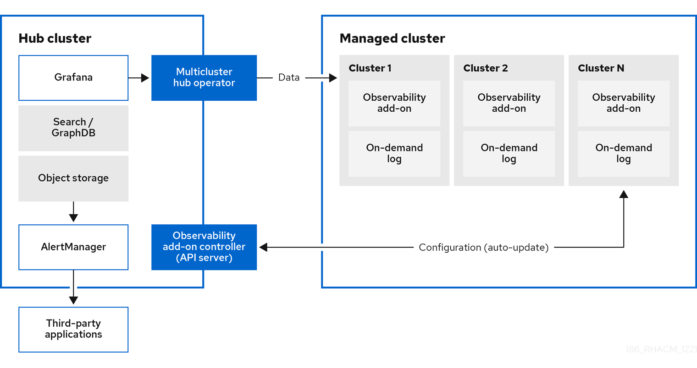

[#observing-environments]
= Observing environments

You can use {product-title} to gain insight and optimize your managed clusters. Enable the observability service operator, `multicluster-observability-operator`, on your hub cluster to monitor the health of your managed clusters. Learn about the architecture for the multicluster observability service in the following sections. 

*Note*: The _on-demand log_ provides access for engineers to get logs for a given pod in real-time. Logs from the hub cluster are not aggregated. These logs can be accessed with the search service and other parts of the console.

* <<observability-service,Observability service>>
* <<metric-types,Metric types>>
* <<observability-pod-capacity-requests,Observability pod capacity requests>>
* <<persistent-stores-observability,Persistent stores used in the observability service>>
* <<observability-support,Support>>

[#observability-service]
== Observability service

By default, observability is included with the product installation, but not enabled. Due to the requirement for persistent storage, the observability service is not enabled by default. {product-title-short} supports the following S3 compatible, stable object stores:

- Amazon S3 
+
*Note*: The object store interface in Thanos support APIs that are AWS S3 restful API compatible, or other S3 compatible object stores like Minio and Ceph.
- Google Cloud Storage
- Azure storage
- Red Hat OpenShift Data Foundation
+
*Important*: When you configure your object store, ensure that you meet the encryption requirements necessary when sensitive data is persisted. For a complete list of the supported object stores, see https://thanos.io/tip/thanos/storage.md/#object-storage[Thanos documentation].

When the service is enabled, the `observability-endpoint-operator` is automatically deployed to each imported or created cluster. This controller collects the data from {ocp} Prometheus, then sends it to the {product-title-short} hub cluster. 

If the hub cluster imports itself as the `local-cluster`, observability is also enabled on it and metrics are collected from the hub cluster.

The observability service deploys an instance of Prometheus AlertManager, which enables alerts to be forwarded with third-party applications. It also includes an instance of Grafana to enable data visualization with dashboards (static) or data exploration. {product-title-short} supports version 8.1.3 of Grafana. You can also design your Grafana dashboard. For more information, see xref:../observability/design_grafana.adoc#designing-your-grafana-dashboard[Designing your Grafana dashboard].

You can customize the observability service by creating custom https://prometheus.io/docs/prometheus/latest/configuration/recording_rules/[recording rules] or https://prometheus.io/docs/prometheus/latest/configuration/alerting_rules/[alerting rules].

For more information about enabling observability, see xref:../observability/observability_enable.adoc#enable-observability[Enable observability service].

[#metric-types]
== Metric types

By default, {ocp-short} sends metrics to Red Hat using the Telemetry service. The `acm_managed_cluster_info` is available with {product-title-short} and is included with telemetry, but is _not_ displayed on the {product-title-short} _Observe environments overview_ dashboard.

View the following table of metric types that are supported by the framework:

.Parameter table
|===
| Metric name | Metric type | Labels/tags | Status

| `acm_managed_cluster_info`
| Gauge
| `hub_cluster_id`, `managed_cluster_id`, `vendor`, `cloud`, `version`, `available`, `created_via`, `core_worker`, `socket_worker`
| Stable

| `policy_governance_info`
| Gauge
| `type`, `policy`, `policy_namespace`, `cluster_namespace`
| Stable. See link:../governance/policy_governance_info.adoc#gov-metric[Governance metric] for more details.

| `policyreport_info`
| Gauge
| `managed_cluster_id`, `category`, `policy`, `result`, `severity`
| Stable. See xref:../observability/manage_insights.adoc#manage-insights[Managing insight PolicyReports] for more details.
|===

Learn from the {ocp-short} documentation what types of metrics are collected and sent using telemetry. See https://access.redhat.com/documentation/en-us/openshift_container_platform/4.11/html-single/support/index#about-remote-health-monitoring[Information collected by Telemetry] for information. 

[#observability-pod-capacity-requests]
== Observability pod capacity requests

Observability components require 2701mCPU and 11972Mi memory to install the observability service. The following table is a list of the pod capacity requests for five managed clusters with `observability-addons` enabled:

.Observability pod capacity requests
|===
| Deployment or StatefulSet | Container name | CPU (mCPU) | Memory (Mi) | Replicas | Pod total CPU | Pod total memory 

.3+| observability-alertmanager 
| alertmanager 

| 4
| 200
| 3
| 12
| 600

| config-reloader
| 4
| 25
| 3
| 12
| 75

| alertmanager-proxy
| 1
| 20
| 3
| 3
| 60

.2+| observability-grafana

| grafana
| 4
| 100
| 2
| 8
| 200

| grafana-dashboard-loader
| 4
| 50
| 2
| 8
| 100

| observability-observatorium-api
| observatorium-api
| 20
| 128
| 2
| 40
| 256

| observability-observatorium-operator
| observatorium-operator
| 100
| 100
| 1
| 10
| 50

.2+| observability-rbac-query-proxy
| rbac-query-proxy
| 20
| 100
| 2
| 40
| 200

| oauth-proxy
| 1
| 20
| 2
| 2
| 40

| observability-thanos-compact
| thanos-compact
| 100
| 512
| 1
| 100
| 512

| observability-thanos-query
| thanos-query
| 300
| 1024
| 2
| 600
| 2048

| observability-thanos-query-frontend
| thanos-query-frontend
| 100
| 256
| 2
| 200
| 512

.2+| observability-thanos-query-frontend-memcached
| memcached
| 45
| 128
| 3
| 135
| 384

| exporter
| 5
| 50
| 3
| 15
| 150

| observability-thanos-receive-controller
| thanos-receive-controller
| 4
| 32
| 1
| 4
| 32

| observability-thanos-receive-default
| thanos-receive
| 300
| 512
| 3
| 900
| 1536

.2+| observability-thanos-rule
| thanos-rule
| 50
| 512
| 3
| 150
| 1536

| configmap-reloader
| 4
| 25
| 3
| 12
| 75

.2+| observability-thanos-store-memcached
| memcached
| 45
| 128
| 3
| 135
| 384

| exporter
| 5
| 50
| 3
| 15
| 150

| observability-thanos-store-shard
| thanos-store
| 100
| 1024
| 3
| 300
| 3072
|===

[#persistent-stores-observability]
== Persistent stores used in the observability service

When you install {product-title-short} the following persistent volumes (PV) must be created so that Persistent Volume Claims (PVC) can attach to it automatically. As a reminder, you must define a storage class in the `MultiClusterObservability` CR when there is no default storage class specified or you want to use a non-default storage class to host the PVs. It is recommended to use Block Storage, similare to what Prometheus uses. Also each replica of `alertmanager`, `thanos-compactor`, `thanos-ruler`, `thanos-receive-default` and `thanos-store-shard` must have its own PV. View the following table:

.Table list of persistent volumes
|===
| Persistent volume name | Purpose 
| alertmanager 
| Alertmanager stores the `nflog` data and silenced alerts in its storage. `nflog` is an append-only log of active and resolved notifications along with the notified receiver, and a hash digest of contents that the notification identified.

| thanos-compact 
| The compactor needs local disk space to store intermediate data for its processing, as well as bucket state cache. The required space depends on the size of the underlying blocks. The compactor must have enough space to download all of the source blocks, then build the compacted blocks on the disk. On-disk data is safe to delete between restarts and should be the first attempt to get crash-looping compactors unstuck. However, it is recommended to give the compactor persistent disks in order to effectively use bucket state cache in between restarts.

| thanos-rule 
| The thanos ruler evaluates Prometheus recording and alerting rules against a chosen query API by issuing queries at a fixed interval. Rule results are written back to the disk in the Prometheus 2.0 storage format. The amount of hours or days of data retained in this stateful set was fixed in the API version `observability.open-cluster-management.io/v1beta1`. It has been exposed as an API parameter in `observability.open-cluster-management.io/v1beta2`: `_RetentionInLocal_` 

| thanos-receive-default 
| Thanos receiver accepts incoming data (Prometheus remote-write requests) and writes these into a local instance of the Prometheus TSDB. Periodically (every 2 hours), TSDB blocks are uploaded to the object storage for long term storage and compaction. The amount of hours or days of data retained in this stateful set, which acts a local cache was fixed in API Version `observability.open-cluster-management.io/v1beta`. It has been exposed as an API parameter in `observability.open-cluster-management.io/v1beta2`: `_RetentionInLocal_`

| thanos-store-shard| It acts primarily as an API gateway and therefore does not need significant amounts of local disk space. It joins a Thanos cluster on startup and advertises the data it can access. It keeps a small amount of information about all remote blocks on local disk and keeps it in sync with the bucket. This data is generally safe to delete across restarts at the cost of increased startup times.
|===

*Note*: The time series historical data is stored in object stores. Thanos uses object storage as the primary storage for metrics and meta data related to them. For more details about the object storage and downsampling, see xref:../observability/observe_environments.adoc#enable-observability[Enable observability service]

[#observability-support]
== Support

{product-title-short} is tested with and fully supported by Red Hat OpenShift Data Foundation (formerly Red Hat OpenShift Container Storage). 

{product-title-short} supports the function of the multicluster observability operator on user-provided third-party object storage that is S3 API compatible.  

{product-title-short} use commercial, reasonable efforts to assist in the identification of the root cause.

If a support ticket is raised and the root cause has been determined to be a result of the customer-provided S3 compatible object storage, then the issue must be resolved using the customer support channels.

{product-title-short} does not commit to fix support tickets raised by customers, where the root cause identified is the S3 compatible object storage provider.

See xref:../observability/observe_environments.adoc#customizing-observability[Customizing observability] to learn how to configure the observability service, view metrics and other data.
