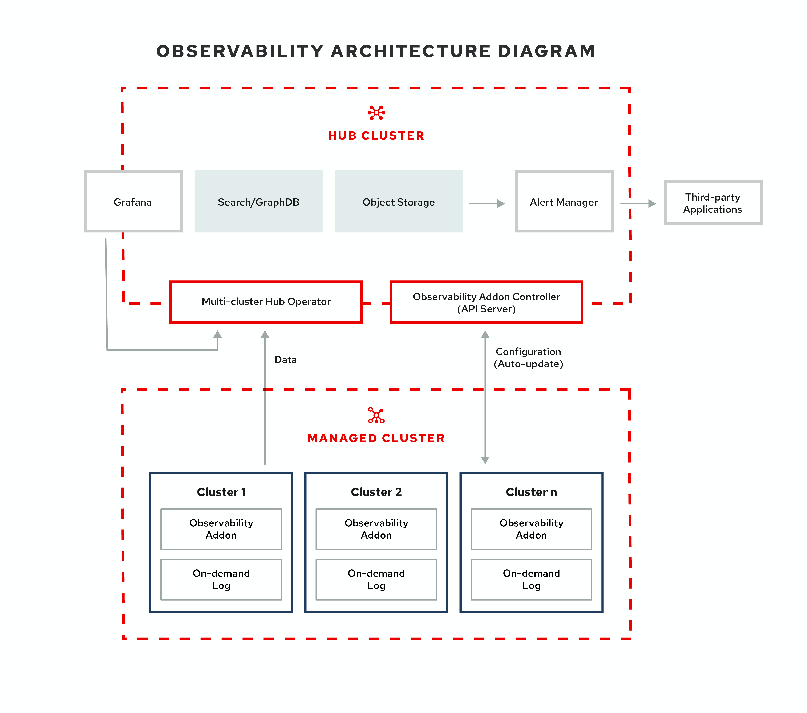

[#observing-environments]
= Observing environments

You can use {product-title} to gain insight and optimize your managed clusters. Enable the observability service operator, `multicluster-observability-operator`, to monitor the health of your managed clusters. Learn about the architecture for the multicluster observability service in the following sections. 

[#observability-service]
== Observability service

By default, observability is included with the product installation, but not enabled. Due to the requirement for persistent storage, the observability service is not enabled by default. {product-title-short} supports the following stable object stores:

- Amazon S3 (or other S3 compatible object stores like Ceph)
- Google Cloud Storage
- Azure storage
- OpenShift Container Storage

When the service is enabled, the `observability-endpoint-controller` is automatically deployed to each imported or created cluster. This controller collects the data from {ocp} Prometheus, then sends it to the {product-title-short} hub cluster. 

When observability is enabled in a hub cluster, metrics are collected by handling the hub cluster as a managed cluster called `local-cluster`.
  
*Note*: In {product-title-short} the `metrics-collector` is only supported for {ocp} 4.x clusters. 

The observability service deploys an instance of Prometheus AlertManager, which enables alerts to be forwarded with third-party applications. It also includes an instance of Grafana to enable data visualization with dashboards (static) or data exploration. You can also design your Grafana dashboard. For more information, see xref:../observability/design_grafana.adoc#designing-your-grafana-dashboard[Designing your Grafana dashboard].

You can customize the observability service by creating custom link:https://prometheus.io/docs/prometheus/latest/configuration/recording_rules/[recording rules] or link:https://prometheus.io/docs/prometheus/latest/configuration/alerting_rules/[alerting rules].

For more information about enabling observability, see link:../observability/observability_install.adoc#enable-observability[Enable observability service].

[#metric-types]
=== Metric types

By default, {ocp-short} sends metrics to Red Hat using the Telemetry service. The following additional metrics are available with {product-title-short} and are included with telemetry, but are _not_ displayed on the {product-title-short} _Observe environments overview_ dashboard:

- The `visual_web_terminal_sessions_total` is collected on the hub cluster.
- The `acm_managed_cluster_info` is collected on each managed cluster and sent to the hub cluster.

Learn from the {ocp-short} documentation what types of metrics are collected and sent using telemetry. See link:https://access.redhat.com/documentation/en-us/openshift_container_platform/4.7/html-single/support/index#about-remote-health-monitoring[Information collected by Telemetry] for information. 

[#observability-pod-capacity-requests]
=== Observability pod capacity requests

Observability components require 5166mCPU and 3936mCPU memory to install the observability service. View the following table of the pod capacity requests that is for five managed clusters with `observability-addons` enabled:

.Observability pod capacity requests
|===
| Container  | CPU (mCPU) | Memory (Mi) | Replicas | Pod total CPU | Pod total memory 

| alertmanager
| 4
| 200
| 3
| 12
| 600

| config-reloader
| 4
| 25
| 3
| 12
| 75

| grafana
| 4
| 100
| 2
| 8
| 200

| grafana-dashboard-loader
| 4
| 50
| 2
| 8
| 100

| observatorium-api
| 20
| 128
| 2
| 40
| 256

| thanos-compact
| 100
| 512
| 1
| 100
| 512

| thanos-query
| 300
| 1024
| 2
| 600
| 2048

| thanos-query-frontend
| 100
| 256
| 2
| 200
| 512

| thanos-receive-controller
| 4
| 32
| 1
| 4
| 32

| thanos-receive
| 300
| 512
| 3
| 900
| 1536

| thanos-rule
| 50
| 512
| 3
| 150
| 1536

| configmap-reloader
| 4
| 25
| 3
| 12
| 75

| memcached
| 45
| 128
| 3
| 135
| 384

| exporter
| 5
| 50
| 3
| 15
| 150

| thanos-store
| 100
| 1024
| 3
| 300
| 3072

| observatorium-operator
| 100
| 100
| 1
| 100
| 100

| rbac-query-proxy
| 20
| 100
| 2
| 40
| 200
|===

[#overview-page-observe]
=== Observe environments Overview page

You can view the following information about your clusters on the _Overview_ dashboard:

* Metric data from your managed clusters by selecting the Grafana link 
* Cluster, node, and pod counts across all clusters and for each provider
* Cluster status
* Cluster compliance
* Pod status

Many clickable elements on the dashboard open a search for related resources. Click on a provider card to view information for clusters from a single provider.

