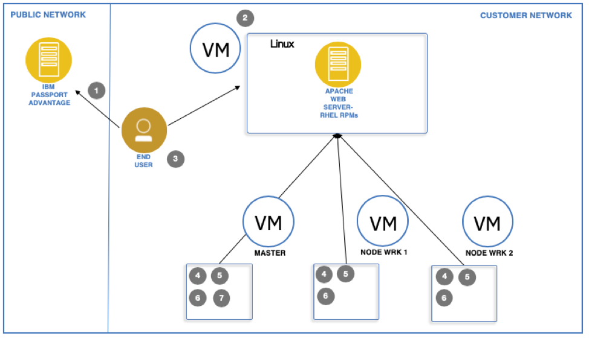

# IBM Cloud Pak for Multicloud Management 1.2 Quick Start Guide with Red Hat OpenShift Guidance

<b>Product Release</b>: 1.2.0

<b>Publication date</b>: December 13 2019

<b>Last modified date</b>: December 10, 2019

This guide provides a quick and easy way to get up and running with the product.

## Description
{: #desc}

The IBM Cloud Pak for Multicloud Management, running on Red Hat OpenShift, provides consistent visibility, governance, and automation from on premises to the edge. Enterprises gain capabilities such as multicluster management, event management, application management, infrastructure management, and existing tools management. Enterprises can use this IBM Cloud Pak to help increase operational efficiency that is driven by intelligent data, analysis, and predictive golden signals, and gain built-in support for their compliance management.

## Contents
{: #contents}

 1. [Online user documentation](#docs)
 2. [Installation](#install)
 3. [List of files](#files)
 4. [IBM Red Hat installation guide](#rhinstall)
 5. [Copyright and trademark information](#notices)

## Online user documentation
{: #docs}

For the most up-to-date IBM Cloud Pak for Multicloud Management user documentation, see https://www.ibm.com/support/knowledgecenter/SSFC4F_1.2.0/kc_welcome_cloud_pak.html.

## Installation
{: #install}

For the recent IBM Cloud Pak for Multicloud Management installation documentation and how to prepare for installation, see https://www.ibm.com/support/knowledgecenter/SSFC4F_1.2.0/install/overview.html.

For information about configuring the Red Hat Ansible Tower with IBM single sign-on, see https://www.ibm.com/support/knowledgecenter/SSFC4F_1.2.0/install/ansible_tower.html.

For information about configuring Red Hat CloudForms with IBM single sign-on, see https://www.ibm.com/support/knowledgecenter/SSFC4F_1.2.0/install/cloudforms.html.

## List of files
{: #files}

This section lists the files that are available on IBM Passport Advantage for your bundle.

Table 1. IBM Cloud Pak for Multicloud Management Core packages
<table border="1" width="100%">
  <tr>
    <th width="50%">Description</th>
    <th width="30%">File name </th>
    <th width="20%">Passport Advantage part number </th>
  </tr>
  <tr>
    <td>IBM Cloud Pak for Multicloud Management Core 1.2 Kubernetes image for AMD64</td>
    <td>ibm-cp4mcm-core-1.2-x86_64.tar.gz</td>
    <td>CC4L8EN</td>
  </tr>
  <tr>
    <td>IBM Cloud Pak for Multicloud Management Core 1.2 Kubernetes image for Power</td>
    <td>ibm-cp4mcm-core-1.2-ppc64le.tar.gz</td>
    <td>CC4L9EN</td>
  </tr>
  <tr>
    <td>IBM Cloud Pak for Multicloud Management Core 1.2 Multicluster-endpoint for AMD64</td>
    <td>mcm-endpoint-3.3.0-amd64.tgz </td>
    <td>CC4LAEN</td>
  </tr>
  <tr>
    <td>IBM Cloud Pak for Multicloud Management Core 1.2 Multicluster-endpoint for Power</td>
    <td>mcm-endpoint-3.3.0-ppc64le.tgz</td>
    <td>CC4LBEN</td>
  </tr>
  <tr>
    <td>IBM Cloud Pak for Multicloud Management Core 1.2 Multicluster-endpoint for IBM Z</td>
    <td>mcm-endpoint-3.3.0-s390x.tgz</td>
    <td>CC4LCEN</td>
  </tr>
  <tr>
    <td>IBM Cloud Pak for Multicloud Management Core 1.2 Key Management HSM</td>
    <td>key-management-hsm-amd64.tar.gz</td>
    <td>CC4PREN</td>
  </tr>
</table>

Table 2. IBM Red Hat Software for IBM Cloud Pak for Multicloud Management packages
<table border="1" width="100%">
  <tr>
    <th width="50%">Description</th>
    <th width="30%">File name </th>
    <th width="20%">Passport Advantage part number </th>
  </tr>
  <tr>
    <td>IBM Red Hat Enterprise Linux 7.7 English Only</td>
    <td>ibm-cloud-pak-mcm-1.2.0-qsg.zip</td>
    <td>CC4KJEN</td>
  </tr>
  <tr>
    <td>Red Hat CloudForms 5 for VMware vSphere with LSI Logic controller</td>
    <td>cfme-vsphere-5.11.x86_64.ovap</td>
    <td>CC4LEEN</td>
  </tr>
  <tr>
    <td>Red Hat CloudForms 5 for VMware vSphere with PVSCSI controller</td>
    <td>cfme-vsphere-pv-5.11.x86_64.ova</td>
    <td>CC4LFEN </td>
  </tr>
  <tr>
    <td>Red Hat CloudForms 5 for Red Hat OpenStack Platform</td>
    <td>cfme-rhos-5.11.x86_64.qcow2</td>
    <td>CC4PSEN</td>
  </tr>
  <tr>
    <td>Red Hat CloudForms 5 for Red Hat Virtualization</td>
    <td>cfme-rhevm-5.11.x86_64.qcow2</td>
    <td>CC4PTEN</td>
  </tr>
  <tr>
    <td>Red Hat CloudForms 5 for Microsoft SCVMM</td>
    <td>cfme-hyperv-5.11.x86_64.zip</td>
    <td>CC4PUEN</td>
  </tr>
  <tr>
    <td>Red Hat Ansible Tower 3.6 key</td>
    <td>temporary-tower-license.txt</td>
    <td>CC4LGEN</td>
  </tr>
  <tr>
    <td>Automation navigation for IBM Cloud Pak for Multicloud Management 1.2</td>
    <td>automation-navigation-updates.sh</td>
    <td>CC4MAEN</td>
  </tr>
</table>

Table 3. IBM Cloud App Management for IBM Cloud Pak for Multicloud Management packages
<table border="1" width="100%">
 <tr>
    <th width="50%">Description</th>
    <th width="30%">File name </th>
    <th width="20%">Passport Advantage part number </th>
  </tr>
  <tr>
    <td>IBM Cloud App Management V2019.4.0 Server Install </td>
    <td>icam_ppa_2019.4.0_prod.tar.gz</td>
    <td>CC4KNEN</td>
  </tr>
  <tr>
    <td>IBM Cloud App Management V2019.4.0 Server Install on Power for ICPMM 1.2</td>
    <td>icam_ppa_2019.4.0_prod_ppc64le.tar.gz</td>
    <td>CC4LHEN</td>
  </tr>
  <tr>
    <td>IBM Cloud App Management V2019.4.0 Agents Install xLinux </td>
    <td>appMgtAgents_xlinux_2019.4.0.tar.gz</td>
    <td>CC4KPEN</td>
  </tr>
  <tr>
    <td>IBM Cloud App Management V2019.4.0 Agents Install Windows </td>
    <td>appMgtAgents_win_2019.4.0.zip </td>
    <td>CC4KQEN</td>
  </tr>
    <tr>
    <td>IBM Cloud App Management V2019.4.0 Agents Install AIX</td>
    <td>appMgtAgents_aix_2019.4.0.tar.gz </td>
    <td>CC4KREN</td>
  </tr>
  <tr>
    <td>IBM Cloud App Management V2019.4.0 Data Collectors Install </td>
    <td>appMgtDataCollectors_2019.4.0.tar.gz</td>
    <td>CC4KSEN</td>
  </tr>
  <tr>
    <td>IBM Cloud App Management V2019.4.0 Agents Install zLinux </td>
    <td>appMgtAgents_zlinux_2019.4.0.tar.gz</td>
    <td>CC4KTEN</td>
  </tr>
  <tr>
    <td>IBM Cloud App Management V2019.4.0 Agents Install Solaris Sparc</td>
    <td>appMgtAgents_solaris_2019.4.0.tar.gz</td>
    <td>CC4KUEN</td>
  </tr>
    <tr>
    <td>IBM Cloud App Management V2019.4.0 Agents Install PLinux</td>
    <td>appMgtAgents_plinux_2019.4.0.tar.gz</td>
    <td>CC4KVEN</td>
  </tr>
  <tr>
    <td>IBM Cloud App Management V2019.4.0 Agents Install PLinuxLE</td>
    <td>agent_ppa_2019.4.0_prod_ppc64le.tar.gz</td>
    <td>CC4KWEN</td>
  <tr>
    <td>Multicluster Event Management Klusterlet on PlinuxLE</td>
    <td>agent_ppa_2019.4.0_prod_ppc64le.tar.gz</td>
    <td>CC4KXEN</td>
  </tr>
  <tr>
    <td>Multicluster Event Management Server on PlinuxLE </td>
    <td>icam_ppa_2019.4.0_prod_lite_ppc64.tar.gz</td>
    <td>CC4KYEN</td>
  </tr>
   <tr>
    <td>Multicluster Event Management Klusterlet on AMD64 </td>
    <td>agent_ppa_2019.4.0_prod_amd64.tar.gz</td>
    <td>CC4KZEN</td>
  </tr>
   <tr>
    <td>Multicluster Event Management Server on AMD64 </td>
    <td>icam_ppa_2019.4.0_prod_lite_amd64.tar.gz</td>
    <td>CC4L0EN</td>
  </tr>
  <tr>
    <td>IBM Cloud Unified Agent V2019.4.0</td>
    <td>unifiedAgent_2019.4.0.tar.gz</td>
    <td>CC4L1EN</td>
  </tr>
  <tr>
    <td> IBM Cloud App Management V2019.4.0 Agents Install Solaris X86 </td>
    <td>appMgtAgents_solaris_x86_2019.4.0.tar.gz</td>
    <td>CC4L2EN</td>
  </tr>
  </table>

 Table 4. IBM Cloud App Management Extension Pack for IBM Cloud pak for Multicloud Management packages
<table border="1" width="100%">
 <tr>
    <th width="50%">Description</th>
    <th width="30%">File name </th>
    <th width="20%">Passport Advantage part number </th>
  </tr>
  <tr>
    <td>IBM Cloud App Management V2019.4.0 Extension Pack xLinux</td>
    <td>appMgtExt_xlinux_2019.4.0.tar</td>
    <td>CC4L3EN</td>
  </tr>
  <tr>
    <td>IBM Cloud App Management V2019.4.0 Extension Pack Windows</td>
    <td>appMgtExt_win_2019.4.0.zip </td>
    <td>CC4L4EN</td>
  </tr>
  <tr>
    <td>IBM Cloud App Management V2019.4.0 Extension Pack AIX</td>
    <td>appMgtExt_aix_2019.4.0.tar</td>
    <td>CC4L5EN</td>
  </tr>
  <tr>
    <td>IBM Cloud App Management V2019.4.0 Extension Pack PLinux</td>
    <td>appMgtExt_plinux_2019.4.0.tar</td>
    <td>CC4L6EN</td>
  </tr>
  <tr>
    <td>IBM Cloud App Management V2019.4.0 Extension Pack PLinuxLE</td>
    <td>appMgtExt_plinuxle_2019.4.0.tar</td>
    <td>CC4L7EN</td>
  </tr>
</table>

Table 5. IBM Cloud Automation Manager packages
<table border="1" width="100%">
  <tr>
    <th width="50%">Description</th>
    <th width="30%">File name </th>
    <th width="20%">Passport Advantage part number </th>
  </tr>
  <tr>
    <td>IBM Cloud Private 3.2.1 for IBM Cloud Automation Manager 4.1 for Linux (x86_64)</td>
    <td>icp-cam-x86_64-4.1.tar.gz</td>
    <td>CC4E1EN</td>
  </tr>
  <tr>
  <td>IBM Cloud Private 3.2.1 for IBM Cloud Automation Manager 4.1 for IBM Z</td>
    <td>icp-cam-s390x-4.1.tar.gz</td>
    <td>CC4E2EN</td>
  </tr>
  <tr>
    <td>IBM Cloud Private 3.2.1 for IBM Cloud Automation Manager 4.1 for Power Linux LE (64-bit)</td>
    <td>icp-cam-ppc-4.1.tar.gz</td>
    <td>CC4E3EN</td>
  </tr>
  <tr>
    <td>IBM Cloud Private 3.2.1 Product ID for IBM Cloud Automation Manager 4.1 Product ID</td>
    <td>icp-cam-prod-id-4.1.txt</td>
    <td>CC4E4EN</td>
  </tr>
</table>

## IBM Red Hat Guide to Install Red Hat Software for IBM Cloud Pak for Multicloud Management 1.2
{: #rhinstall}

This guide provides a quick and easy way to install Red Hat software.

The IBM Cloud Pak for Multicloud Management includes entitlement to use Red Hat OpenShift Container Platform, Red Hat Enterprise Linux CoreOS (RHCOS), and Red Hat Enterprise Linux (RHEL). RHCOS is the only supported operating system for OpenShift Container Platform master node hosts. RHCOS and RHEL are both supported operating systems for OpenShift Container Platform worker node hosts, though RHCOS is the default.

### Installing Red Hat OpenShift Container Platform

OpenShift Container Platform 4.x can be downloaded and installed by accessing Red Hat OpenShift Cluster Manager at https://cloud.redhat.com/openshift/install by using your Red Hat account, which can be created freely, without a paid Red Hat subscription entitlement to any IBM offering.

If you do not yet have a Red Hat account, create one for free at https://www.redhat.com/wapps/ugc/register.html before you follow the remaining instructions.

If you have a Red Hat account, navigate to https://cloud.redhat.com/openshift/install and log in with your account credentials.

The cluster manager displays several tiles that represent various cloud providers and infrastructure types. Click the tile for the type of infrastructure where you would like to install the OpenShift Container Platform. Some cloud providers support Installer-Provisioned Infrastructure, which installs OpenShift Container Platform on cloud infrastructure that is automatically provisioned by the Cluster Manager. For other cloud providers and infrastructure types, a cluster can be installed on User-Provisioned Infrastructure.

Select your preferred infrastructure type and choose either `Installer-Provisioned Infrastructure` or `User-Provisioned Infrastructure`, and then follow the instructions that are displayed.

For any of the User-Provisioned Infrastructure types, including the “Bare Metal” tile, you are presented with a short series of steps to follow. For detailed installation instructions, you can click the “Get Started” link to open the official installation documentation. For the “Bare Metal” infrastructure type, see the documentation: https://docs.openshift.com/container-platform/4.2/installing/installing_bare_metal/installing-bare-metal.html.

1. Download the OpenShift installer by using the link provided by the Cluster Manager website. These files are accessible directly over the internet, and do not require a Red Hat ID to download.
2. Download or copy your OpenShift pull secret. This step requires you to be logged in with a Red Hat ID but does not require a paid subscription.
3. Download Red Hat Enterprise Linux CoreOS (RHCOS) by using the link provided by the Cluster Manager website. These files are accessible directly over the internet, and do not require a Red Hat ID to download.
4. Download the OpenShift Command Line Tools (openshift-install) by using the link that is provided by the Cluster Manager website and add them to your PATH. These files are accessible directly over the internet, and do not require a Red Hat ID to download.
5. Follow the official documentation for your infrastructure type to complete the installation by using the openshift-install command. When the installer is complete, you see the console URL and credentials for accessing your new cluster. A kubeconfig file is also be generated for you to use with the oc CLI tools you downloaded.

### Optional: accessing Red Hat Enterprise Linux installation binaries

RHCOS is the only supported operating system for OpenShift Container Platform master node hosts. RHCOS and RHEL are both supported operating systems for OpenShift Container Platform worker node hosts, though RHCOS is the default. If you prefer to use Red Hat Enterprise Linux (RHEL) as the operating system for the worker node hosts, you need to download the RHEL installation binary files separately, as they are not available to download without paid entitlement.

The preferred method of accessing and installing RHEL is to follow the standard installation documentation from Red Hat and register your systems by using your Red Hat Network subscription. Installation binary files, documentation, and entitlement information can all be accessed from the Red Hat Customer Portal at https://access.redhat.com. If you are new to the Red Hat Customer Portal, click *Getting Started* after you log in (or use this link: https://access.redhat.com/start/) to take a guided tour and learn how to get the most out of your Red Hat subscription.

### Preferred method for accessing RHEL: By using the Red Hat Customer Portal

#### Accessing installation binary files through the Red Hat Customer Portal

After your Cloud Pak order has been processed, you will receive an email from Red Hat at the address that is associated with your order. This email lists the entitlement quantities for your Red Hat OpenShift Container Platform and subscription has been updated.

#### Installing Red Hat Enterprise Linux

OpenShift Container Platform 4.2 is supported on Red Hat Enterprise Linux 7.6 or later. If you do not already have Red Hat Enterprise Linux installed, use the following documentation to complete the installation of Red Hat Enterprise Linux.

Red Hat Enterprise Linux 7.7 installation media can be accessed through the Red Hat Customer portal at https://access.redhat.com/downloads/content/69/ver=/rhel---7/7.7/x86_64/product-software

Instructions for downloading and installing Red Hat Enterprise Linux 7, including registering your installation by using Subscription Manager, can be found in the Red Hat Customer Portal at: https://access.redhat.com/documentation/en-us/red_hat_enterprise_linux/7/html/installation_guide/chap-getting-started

#### Installing Red Hat OpenShift Container Platform

When you have successfully provisioned hosts or virtual machines with Red Hat Enterprise Linux installed and registered, proceed to install OpenShift Container Platform 4.2 by following the documentation provided in the Red Hat Customer Portal: https://access.redhat.com/documentation/en-us/openshift_container_platform/4.2/html-single/installing/index

### Alternative Method for accessing RHEL: By using IBM Passport Advantage

#### Accessing binary flies for manual installation from IBM Passport Advantage

If you require the ability to install the Cloud Pak before your entitlements have been updated in the Red Hat Customer Portal, all of the binary files necessary to install Red Hat OpenShift Container Platform and Red Hat Enterprise Linux CoreOS are available for download by using a freely available Red Hat ID as described earlier. These binary files are not available for download from IBM Passport Advantage.

If you choose to install Red Hat Enterprise Linux as the host operating system on your worker nodes before and do not yet have an active Red Hat subscription, Red Hat Enterprise Linux 7.7 is accessible through IBM Passport Advantage. Installation images and RPMs for Red Hat Enterprise Linux 7.7 can be downloaded from IBM Passport Advantage (Part number CC4KJEN), which is part of your Cloud Pak eAssembly.) This file has the description “IBM Red Hat Enterprise Linux English only eImage” in IBM Passport Advantage. This installation is required to be registered and associated with your Red Hat Network ID later.

The download is approximately 50 GB, and extra storage is required when you extract the files.

This manual installation process requires the creation of a local HTTP server to host the RPM files that are provided in the mentioned download package. These steps are not required when you use the preferred installation method, since that scenario enables access to the necessary files through Red Hat Network.

To perform a manual installation, follow this procedure:

1. Download the Red Hat Enterprise Linux installation files from Passport Advantage (if you don’t already have Red Hat Enterprise Linux installed)
2. Provision a web server to host a Yum repository
3. Copy the downloaded files to the web server
4. Install Red Hat Enterprise Linux on the worker nodes
5. Install OpenShift Container Platform by using the official documentation

#### Download the Red Hat Enterprise Linux installation files from Passport Advantage

Log in to IBM Passport Advantage and download “IBM Red Hat Enterprise Linux English only eImage” (part number CC4KJEN), which is associated with the Cloud Pak eAssembly. The file name to download is `IBM_RED_HAT_ENTERPRISE_LINUX_ENGLISH.tgz`.

#### Provision a web server to host a Yum repository

Provision a physical host or virtual machine with an HTTP server to support the local installation. You can use the web server of your choice as the repository.

If you do not have a web server available, you can install and configure the Apache web server on a Red Hat Enterprise Linux system by using the documentation that is provided by Red Hat under the heading “Prepare and populate the repository server”: https://docs.openshift.com/container-platform/3.11/install/disconnected_install.html#disconnected-repo-server

#### Copy the downloaded files to the web server

Copy `IBM_RED_HAT_ENTERPRISE_LINUX_ENGLISH.tgz` to the web server and extract it into a subdirectory named “repos” under your web server’s document root (/var/www/html/repos if you have created a web server by using the documentation).

Ensure that the repository files can be read by any user (chmod -R +r /var/www/html/repos).

### Install Red Hat Enterprise Linux on the worker nodes

If you don’t already have Red Hat Enterprise Linux installed, provision the hosts or VMs that are used for the master and worker nodes for the OpenShift Container Platform cluster where you install the Cloud Pak, and install Red Hat Enterprise Linux by using the ISO downloaded from IBM Passport Advantage.

Complete instructions for downloading and installing Red Hat Enterprise Linux, including prerequisites and host preparation, can be found in the Red Hat Customer Portal at: https://access.redhat.com/documentation/en-us/red_hat_enterprise_linux/7/html/installation_guide/chap-getting-started

* An ISO image of the installation media (rhel-server-7.7-x86_64-dvd.iso) can be found in the directory where you extracted the file that is downloaded from IBM Passport Advantage. Use these files in place of steps in Chapter 2 of the Red Hat Enterprise Linux installation guide that describe downloading Red Hat Enterprise Linux from the Red Hat Customer Portal. If you are creating virtual machines to provision your nodes, this image can be used directly.
* If you are installing Red Hat Enterprise Linux on a physical host, refer to Chapter 3 of the Red Hat Enterprise Linux installation guide for information on creating physical installation media or accessing installation media over a network: https://access.redhat.com/documentation/en-us/red_hat_enterprise_linux/7/html/installation_guide/chap-making-media

#### Install Red Hat OpenShift Container Platform by using the official documentation

Follow the documentation provided by Red Hat to install OpenShift Container Platform 4.2: https://access.redhat.com/documentation/en-us/openshift_container_platform/4.2/html-single/installing/index

## Copyright and trademark information
{: #notices}

© Copyright IBM Corporation 2019

U.S. Government Users Restricted Rights - Use, duplication or disclosure restricted by GSA ADP Schedule Contract with IBM Corp.

IBM®, the IBM logo, and ibm.com® are trademarks of International Business Machines Corp., registered in many jurisdictions worldwide. Other product and service names might be trademarks of IBM or other companies. A current list of IBM trademarks is available on the Web at "Copyright and trademark information" at www.ibm.com/legal/copytrade.shtml.
