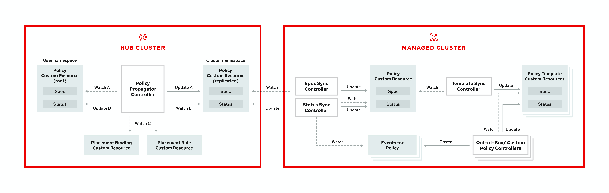

[#governance-and-risk]
= Governance and risk

Enterprises must meet internal standards for software engineering, secure engineering, resiliency, security, and regulatory compliance for workloads hosted on private, multi and hybrid clouds. Red Hat Advanced Cluster Management for Kubernetes governance provides an extensible policy framework for enterprises to introduce their own security policies.

[#governance-architecture]
== Governance architecture

Enhance the security for your cluster with the Red Hat Advanced Cluster Management for Kubernetes governance lifecycle. The product governance lifecycle is based on defined policies, processes, and procedures to manage security and compliance from a central interface page. View the following diagram of the governance architecture:

The governance architecture is composed of the following components:

* **Goverance and risk dashboard**: Provides a summary of your cloud governance and risk details, which include policy and cluster violations.You can create, view, and manage your security policies from the _Policies_ page.
* **Policy YAML editor**: Support policy creation and deployment to various managed clusters based on attributes associated with clusters, such as
a geographical region.
* **Controls**: Security and configuration controls are designed for various enterprise standards. View more information on the following predefined standards: link:https://www.hhs.gov/hipaa/index.html[HIPAA], link:https://www.nist.gov/cyberframework/new-framework[NIST], link:https://www.pcisecuritystandards.org/[PCI-DSS], link:https://seasoft.com/blog/fisma-affect-ibm/[FISMA].
* **Policy controller**: Evaluates one or more policies on the managed cluster against your specified control, and generates Kubernetes events for
violations. Violations are propagated to the hub cluster.

You can customize your _Summary_ view by filtering the violations by categories or standards.
Collapse the summary to see less information.
You can also search for policies.

NOTE: When you search for a policy in the hub cluster, you might also receive the name of the replicated policy on your managed cluster.
For example, if you search for `policy-dhaz-cert`, the following policy name from the hub cluster might appear: `default.policy-dhaz-cert`.
The name of the replicated policy might appear as the following name: `namespace-in-hub.policyname`.

You can view a table list of violations.
The following details are provided in the table: description, resources, severity, cluster, standards, controls, categories, and update time.
You can filter the violation table view by policies or cluster violations.

Learn about the structure of an Red Hat Advanced Cluster Management for Kubernetes policy, and how to use the Red Hat Advanced Cluster Management for Kubernetes Governance and risk dashboard.

* link:policy_example.md.adoc[Policy overview]
* link:policy_controllers.md.adoc[Policy controllers]
* link:policy_sample_intro.md.adoc[Policy samples]
* link:create_policy.md.adoc[Managing security policies]
